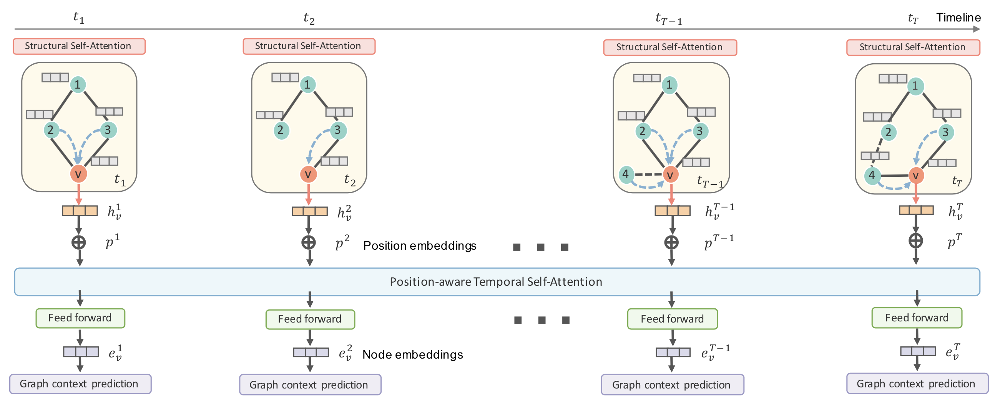

# DySAT: Deep Neural Representation Learning on Dynamic Graphs via Self-Attention Networks

## 0 论文信息

**Conference**: WSDM' 20

## 1 模型

### 1.1 Structural Self-Attention 结构自注意

与GAT中的注意力机制类似，相当于一个邻居结点信息汇聚层。

- 表示节点的特征，如果没有特征，则用 one-hot 向量表示

- 计算 attention 系数

  $e_{uv} = \sigma(A_{uv} \cdot \alpha^T [W^sx_u||W^sx_v])$

  $\alpha_{uv} = \frac{exp(e_{uv})}{\sum_{w \in N_v} exp(e_{wv})}$

- 计算聚合邻居后的 embedding（进行加权求和）

  $z_{v} = \sigma(\sum_{u \in N_v} \alpha_{uv}W^sx_u)$

### 1.2 Temporal Self-Attention 时间自注意

这部分是为了捕捉动态图在时间上的变化模式。计算结点 $v$ 在 $t$ 时的表征时，将在 $t$ 之前的 $v$ 的表征作为 temporal self-attention 模块的输入，输出的是结点 $v$ 在各个事件点的表征（此时的表征考虑了动态性），计算公式如下：

$e_v^{ij} = (\frac{((X_vW_q)(X_vW_k)^T)_{ij}}{\sqrt{F'}} + M_{ij})$

$\beta_v^{ij} = \frac{exp(e_v^{ij})}{\sum^{T}_{k=1}exp(e^{ik}_v)}$

$Z_v = \beta_v(X_vW_v)$

$M_{ij} = \begin{cases} 0, \quad i\leq j \\-\infty , \quad otherwise\\\end{cases}$

其中，$(X_vW_q)$ 为 self-attention 中的 value 值，$(X_vW_k)$ 为 self-attention 中的 key 值，$\sqrt{F'}$ 为缩放因子，$M_{ij}$ 为掩码矩阵

### 1.3 损失函数

$L=􏰆􏰆􏰂 􏰆\sum_{t=1}^{T} \sum_{v \in V} (\sum_{u \in N^t_{walk}}(v) -log(\sigma(<e^t_u, e^t_v>))\\ -w_n \cdot \sum_{u' \in P^t_n(v)} log(1-\sigma(<e^t_{u'}, e^t_v>)))$

## 2 其他

- 只能适用于结点不变化的动态图

