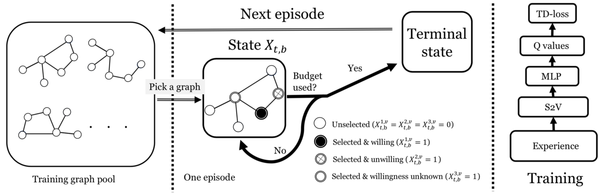

# Contingency-Aware Influence Maximization: A Reinforcement Learning Approach

> **偶然性影响最大化**结合**深度强化学习**。

> 偶然性影响力最大化在每一轮后才能确定选中的种子是否愿意被激活，因此 MDP 中的状态转移、奖励函数的设计都不再常规。

## 0 论文信息

**作者**：Haipeng Chen, Wei Qiu, Han-Ching Ou, Bo An, Milind Tambe

**学校**：Harvard University, Nanyang Technological University

**会议**：UAI' 2021

**Code**: Pytorch, https://github.com/Haipeng-Chen/RL4IM-Contingency

## 1 论文背景

**定义：**

Contingency-Aware Influence Maximization  偶然性影响最大化

节点是否愿意成为被邀请的种子是不确定的，称为偶然性影响最大化。

**挑战：**

1. 在以前的 IM 方法的 RL 中，MDP 的状态(以及状态转换)是先前选择的节点，这是确定的。在偶然性影响最大化问题中，在当前步骤之前选择的节点的意愿状态是未知的。因此，在制定一个 MDP 模型时，仍然存在一个问题，即如何定义一个很好地包含不确定性信息的状态。
2. 在之前的工作中，直接奖励被设置为当前时间步长的新节点的边际贡献。由于节点状态的不确定性，这不能简单地应用到我们的问题中。此外，它在新节点的边际贡献中引入了极高的方差，从而使 RL 训练更具挑战性。

**贡献：**

1. 是第一个使用 RL 方法解决偶然性 IM 问题。针对这个问题，我们提出一个新的 MDP 方案。
2. 技术贡献是一种新的 RL 算法，它建立在使用 RL 解决图上的组合优化问题的工作基础上，同时利用问题的特性进行非平凡的、基于理论的适应。
3. 进行了广泛的实验评估，并表明在各种设置下，本文提出的解决方案可以与来自艾滋病预防领域的最先进的贪婪 IM 算法一样好。消融研究结果证明了这两种新成分的有效性。

## 2 问题定义

图 $G(V, E)$ 采用 $IC$ 传播模型，种子集的选择分 $t=1...T$ 共 $T$ 轮进行，每一轮选择 $B$ 个节点。在每一轮中，所选择的节点用 $S_t$ 表示。

根据偶然性影响最大化的定义，节点 $v \in S_t$ 不一定愿意成为种子，因此，为了捕捉这个不确定性，用 $q$ 表示该节点愿意成为种子的概率。（假定该概率是先验的，可以用历史数据的统计来估计）

在每轮的节点选择结束时，才能观察到该轮被选节点的意愿状态。用 $O_t$ 表示在 $t$ 轮最终愿意成为种子的节点集。（显然有 $O_t \subseteq S_t$）

最后，所有种子的选择历史和意愿状态表示为序列 $h_t = ((S_1, O_1)…(S_t, O_t))$。

## 3 构建 MDP

由于前面问题定义时，将 Contingency-Aware IM 问题规划为多轮选择种子集，因此将其表述为离散时间 MDP。

**Time Step**

将每轮的每个节点选择作为一个时间步长。而每个干预轮称为主要步骤 t，并将每个主要步骤中每个单独节点的选择称为子步骤 (t, B)，子步骤 即为一个时间步长。

因为 t = 1...T，并且 b=1...B， 因此时间范围有 T × B。

**State**

$(G, X_{t,b})$表示当前图的整体状态。其中 $G$ 表示该图的邻接矩阵，$G_{t,b}$ 表示图中节点状态。

$X^v_{t,b}$ 表示节点 $v$ 在该子步骤的状态，每个节点有三种状态，

> $X^{1,v}_{t,B}=1$ 表示节点 $v$ 在该子步骤中被选为种子节点，并愿意成为种子
>
> $X^{2,v}_{t,B}=1$ 表示节点 $v$ 在该子步骤中被选为种子节点，但不愿意成为种子
>
> $X^{3,v}_{t,B}=1$ 表示节点 $v$ 在该子步骤中被选为种子节点，但步骤 t 未结束，节点 $v$ 的意愿未知

**Action**

将在每个**子步骤**中选择单个节点记作 sub-action，sub-action 是一个 one-hot 向量，表示为 $a_{t,B} \in \{0,1\}^{|V|}$，即对未激活节点标注为 0，激活节点标注为 1。

因此，action 即为在每个步骤中的 sub-action 和，即 $A_t = \sum_{b=1}^B a_{t,b}, \forall t=1...T$

**State Transition**

在每个子步骤结束时，有 $X_{t, b+1}^3 = X_{t,b}^3+a_{t,b}$

在每个步骤结束时，需要确定被选中的节点是否接受成为种子，其转移概率为 q 。

令 $\overline {A}_t^v=1$ 表示节点 v 在步骤 t 愿意成为种子。

令 $\overline{B}_t := \sum_{v=1}^{|V|} A_t^v$ 表示在 t 步骤最终被激活的节点**数量**。

则在下一子步骤发生前的三种状态如下，

> $X_{t+1, b=1}^1 = X_{t, B}^1 + \overline{A}_t$,
>
> $X_{t+1, b=1}^2 = X_{t, B}^2 + A_t - \overline{A}_t$
>
> $X_{t+1, b=1}^3 = 0$

则，状态转移概率即为，

$P(X_{t+1}, A_t \rightarrow \overline{A}_t | X_{t, B},A_t) = q^{\overline{B}_t}(1-q)^{B-\overline{B}_t}$

**Reward**

总奖励为在图 G 上的总影响力大小，将总奖励表示为 $r(G, X_{T,B})$

如果使用总奖励作为对应 action 的激励，会导致奖励稀疏性的问题，这使得 RL 难以有效学习。

其他论文的做法是将边际收益作为即时奖励，$\Delta I(G, S ,v) :=I(G, S \bigcup \{v\})-I(G,S)$

但该做法不适用于本文的问题，因为每个干预轮 t 内的节点意愿具有不确定性。

因此，将即时奖励定义为,

$r(G, X_{t,b}, a_{t,b})=\sum_{\beta=0}^{b-1}q^\beta (1-q)^{b-1-\beta} \sum_{X_{t,b}^3}\delta I(G, X_{t,b}, a_{t,b})|\overline{B}_{t,b}=\beta$

由于该奖励函数计算的时间成本较大，因此修改为：$\widetilde{r}(X_{t,b}, a_{t,b})=(1-q)\delta I_0 + q\delta I_{b-1}$

**Q-function**

$Q(X_{t,b} , a_{t,b}) = r(X_{t,b}, a_{t,b}) + γ \ arg max_{a_{t′,b′}} \overline{Q}(X_{t′,b′} , a_{t′,b′})$

$\overline{Q}(X_{t,b} , a_{t,b}) = MLP(f(X_{t,b},G),g(a_{t,b},G)),$

其中，$f(X_{t,b}, G)$ 表示当前节点状态的嵌入信息，$g(a_{t,b},G)$ 表示当前激活某节点的图的嵌入信息。

**Loss-function**

$L(w) = \frac{1}{2} (\overline{Q} − Q)^2$

## 4 模型

左边是训练图 G 的集合，该过程从训练图中随机选择一个图 g 开始。

每个采样的训练图构建一个环境，它定义了一个新的 MDP。在每个时间步长 $(t, b)$，它从环境中观察状态 $X_{t,b}$，并确定预算是否被用尽。

如果预算没有用完，则根据其学习策略 $π(a_{t,b}|X_{t,b})$ 确定下一个要选择的种子，该策略是给定当前状态 $X_{t,b}$ 的可行 action 空间上的概率分布。

如果该图的预算用完了，算法将选择下一个图进行训练，并且训练过程迭代直到 RL 策略达到收敛。

