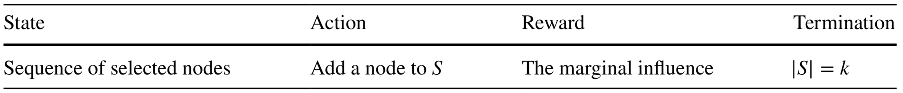
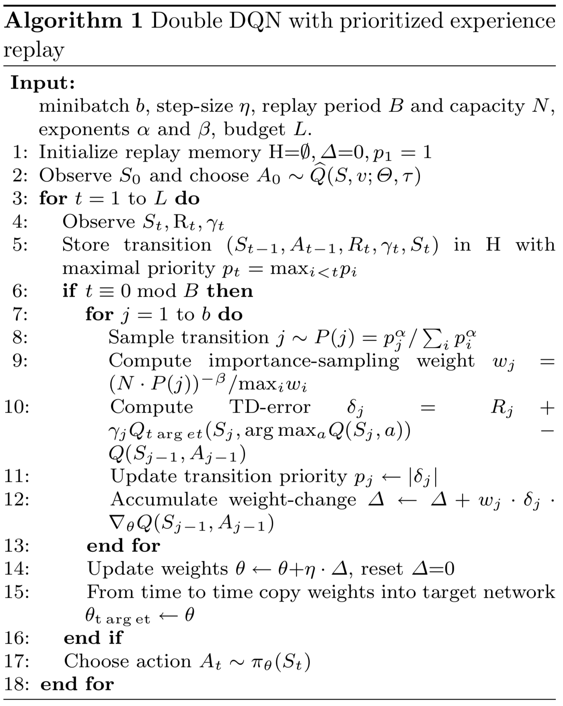
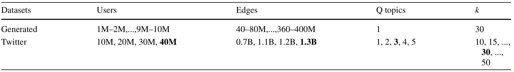
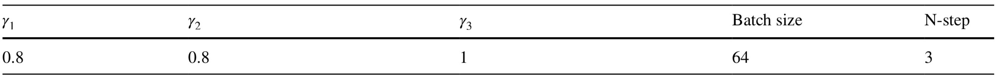
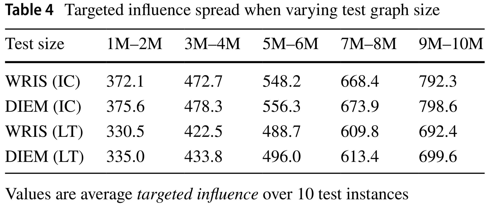
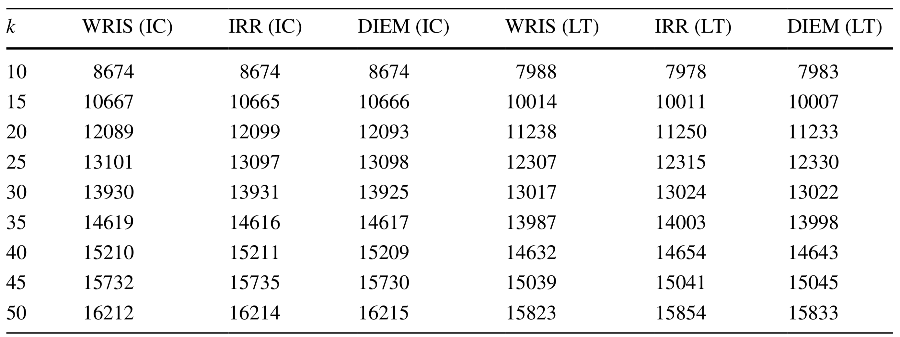
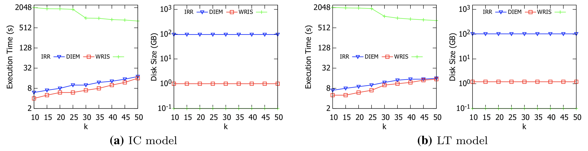
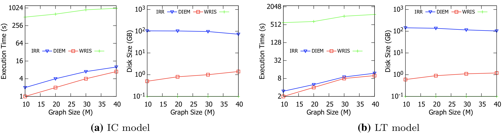

# Deep Reinforcement Learning‐Based Approach to Tackle Topic‐Aware Influence Maximization

> 用图嵌入+强化学习解决主题感知 (topic-aware) 影响力最大化

## 1 论文信息

**Author**: Shan Tia, Songsong Mo, Liwei Wang, Zhiyong Peng

**Journal**: Data Science and Engineering 2020

## 2 背景

主题感知 (topic-aware) 影响力最大化有两大分支：

* 节点是主题感知的
  * 节点是主题感知的，并希望得到话题相关用户的影响力最大化。
  * 该方面的研究主要集中在区分用户和计算在特定查询主题下通过他们的利益对激活用户的影响。
* 边是主题感知的
  * 边是主题感知的，并希望在新的扩散模型下最大化影响。
  * 该方面的研究侧重于提出新的扩散模型，用于捕获不同查询主题下的动态概率。
  * 最常用的模型将每条边与每个主题下的概率相关联，并计算每个查询下的传播概率作为相关概率的预期总和。

> 第一种忽略了依赖于查询主题的动态扩散概率。
>
> 第二种没有同时考虑将概率与用户的兴趣、相似性和联系频率相关联。所以这两个分支都不能完全解决TIM问题。

## 3 问题定义

令 $\tau$ 表示查询的主题，$\sigma_G(S|\tau)$ 即表示在该主题和种子集下的影响力延展度。

目标函数即为，$𝜎_G(S^∗|𝜏) = argmax_{S⊆V∧|S|=k}𝜎_G(S|𝜏)$

## 4 图嵌入

### 4.1 Social Network Mining

提出了三个由基于用户的协同过滤算法驱动的指标，以将前面提到的主题感知的两大分支合并在一起。

1. 对每个主题的加权占比
2. 用户相似度
3. 用户之间的联系频率

### 4.2 Topic‐Aware IC Model

IC 模型中边概率为，$p_{uv} = (\gamma_1w_{uv} + \gamma_2sim(u, v) + \gamma_3B_v^\tau )∕3$

$w_{uv}$ 联系频率，$sim(u, v)$ 用户相似性，$B^\tau_v$ 特定主题的权重，$\gamma_1, \gamma_2, \gamma_3$ 用于平衡三个指标之间的权重。

???+ example "Example"
    $B_v=[0.7, 0.3, 0.0]$  {(music,0.7), (sport,0.3), (politics,0.0)}

    $B_u=[0.5, 0.3, 0.2]$  {(music,0.5), (sport,0.3), (politics,0.2)}
    
    $sim(u, v)=\frac{B_vB_u}{\Vert B_v \Vert \Vert B_u \Vert}$  

### 4.3 Topic‐Aware LT Model

LT 模型中，阈值设置为 $\theta_v = 1 − \gamma_3B^𝜏_v$，边权重设置为 $b_{u,v} = (\gamma_1w_{uv} + \gamma_2sim(u, v))$

节点满足 $\sum_{u∈N_I(v)} B_{u,v} ≤ 1$ 即被激活。

### 4.4 Diffusion2Vec

目前主流的图嵌入技术 Structure2Vec 由于缺乏对**节点属性**和**信息扩散特性**的考虑，不能直接用于本文的问题设置中。

因此，作者提出了一种新方法 Diffusion2Vec，它同时考虑了用户的属性和动态传播概率。

$u^{(t+1)}_v ← F(X_v , \{u^{(t)}_u\}_{u \in N(v)} , \{p(u, v)\}_{u \in N(v)} ;\Theta).$

$X_v$ 为包含了有用的用户信息的向量，$X_v[0]$ 为节点是否为种子节点， $X_v$ 的剩余部分为各主题的权重。

???+ example "Example" 
    eg.  节点 v 没被激活，且{<music,0.7>, <sport,0.3>, <politics,0.0>}，则 $X_v=[0,0.7,0.3,0.0]$

### 4.5 Deep Influence Evaluation Model

具体的嵌入定义如下，

$u^{(t+1)} ← relu(\theta_1 X_v + \theta_2 \sum_{u∈N(v)}u^{(t)}_u + \theta_3 \sum_{u∈N(v)} relu(\theta_4 p(u,v)))$

预测模型的 $\widehat{Q}$ 值即为，

$\widehat{Q}(S, v;\Theta, \tau) = \theta_5 relu([\theta_6 \sum_{u \in S} u^{(T)}_u, \theta_7 u^{(T)}_v])$

## 5 构建 RL

states, actions, rewards, policy 分别如下，

policy 即为最大化 $\widehat{Q}$，也即，$\pi(v|S,𝜏)∶=argmax_{v \in \overline{S}} \widehat{Q}(v', S| \tau)$

{width=400}

## 6 实验设置

### 6.1 数据集

**合成数据集**

用 BA 生成随机网络，将每个节点与随机生成的正则化向量（其长度等于查询主题的总数）相关联，以模拟用户的个人资料。

**真实数据集**

### 6.2 参数设置

### 6.3 Baseline

**WRIS**

一种基于 RIS 的加权采样技术，并实现了 (1 − 1∕e − 𝜀) 的近似比。

**IRR**

WRIS 的扩展解决方案

## 7 实验结果

### 7.1 在合成数据集中比较

{width=400}

* ==与baseline相比，影响力延展度差异不大，DIEM 与 WRIS 相比都取得了非常好的性能。==

* ==主题感知 IC 模型下的总影响力传播略高于主题感知 LT 模型==

### 7.2 在真实数据集中比较

评估 DIEM 框架在从 Twitter 收集的真实世界数据集上的效率和有效性

#### 7.2.1 改变种子集大小

{width=500}

* ==影响力大小：所有方法估计得到的影响力大小几乎没有区别。==

* ==运行时间：DIEM 优于 IRR 和 WRIS 快。==

* ==占用磁盘空间：WRIS 占用磁盘空间最少，但 DIEM 优于 IRR。==

#### 7.2.2 改变图的大小

* ==在运行时间上，DIEM 和 IRR 在所有情况下都明显优于 WRIS。== 

* ==DIEM 仍然比 IRR 占用更少的磁盘空间。==

* ==随着图规模的增长，需要为 IRR 指数构建更多的 RR 集，而 DIEM 只需要在神经网络中维护更多的参数。 它表明 DIEM 在不影响其性能优势的情况下对更大的图更有效。==

#### 7.2.3 改变主题数量

* ==在运行时间上，DIEM 比 IRR 略快，但在磁盘占用上，DIEM 有明显优势。==
