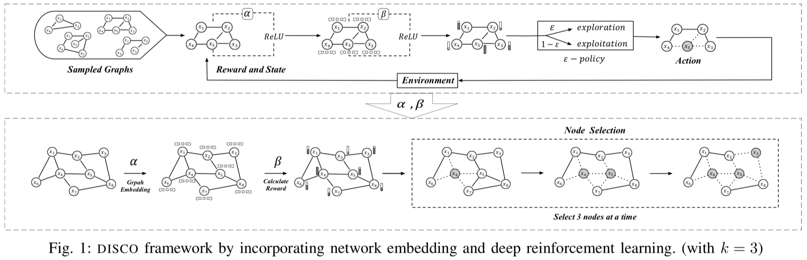
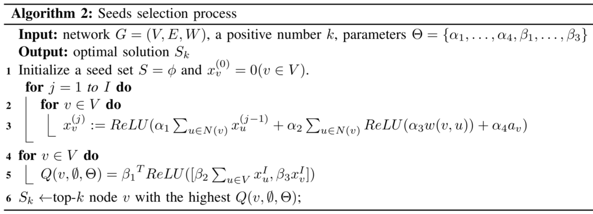
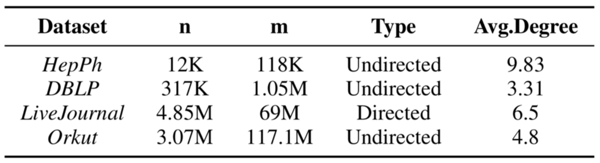
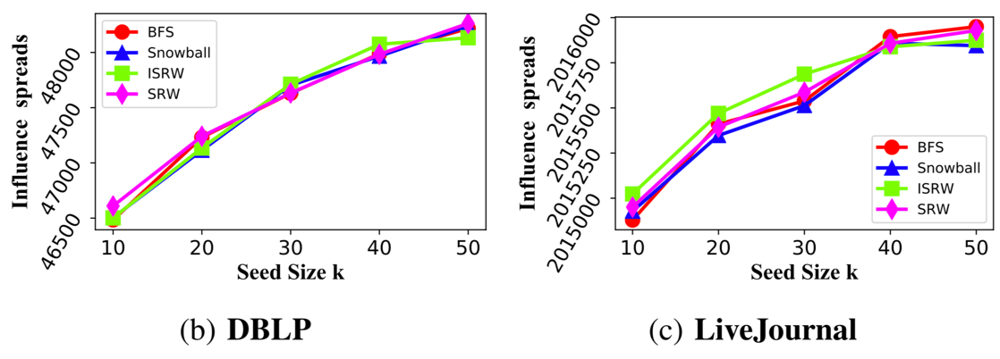
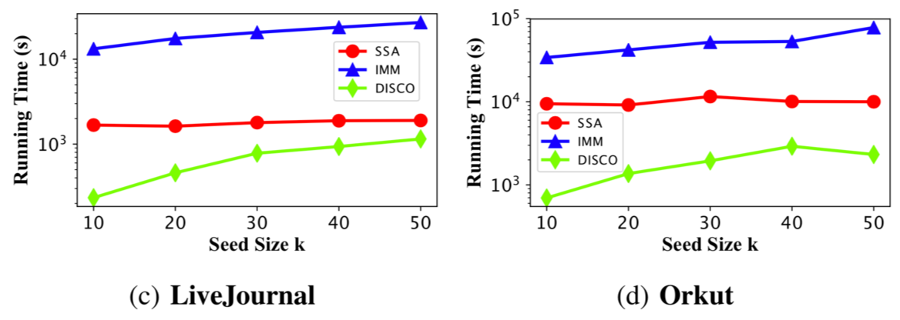
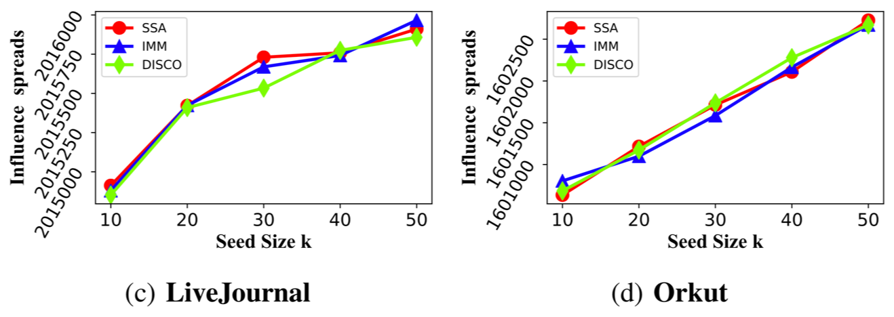
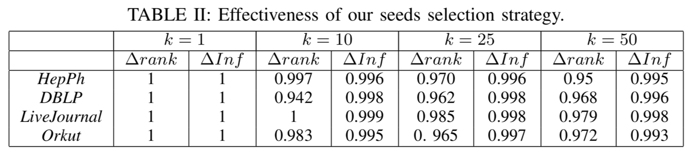
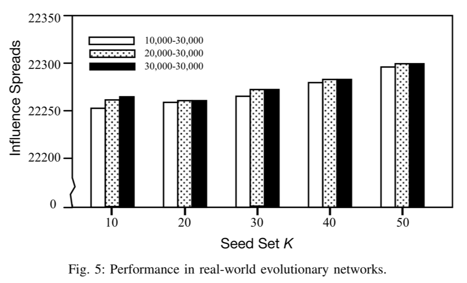

# DISCO: Influence Maximization Meets Network Embedding and Deep Learning

> ==内容==: 强化学习 + Structure2Vec 解决影响力最大化问题

> ==创新点==: 对大型社交网络的预处理、对动态网络的预处理、测试阶段直接取前 k 个节点而无需迭代选取

## 1 概要
  - 在学习阶段，使用深度强化学习技术将 $\sigma(v, S)$ 近似为 $\widetilde{\sigma}(v, S; Θ)$。
  - 对于每个潜在的种子，不是通过对扩散路径进行采样来估计其最大影响，而是通过学习映射函数直接预测其影响大小。
  - 为了学习映射，采用网络嵌入方法将网络拓扑表示为基于向量的特征，进一步作为深度强化学习的输入。
  - 在模型中，可以同时选择所有种子，而不是迭代地选择 k 个种子。

## 2 DISCO 模型

### 2.1 训练阶段
???+ note "嵌入节点"
    在应用 DQN 模型之前，我们首先用 Structure2vec 根据拓扑信息提取节点的特征。

    但是，原始的 Structure2vec 模型不能直接应用于 DQN。因此，提出如下的变体：

    $x_v^{(i)}:=ReLU(\alpha_1 \sum_{v \in N(v)}x_u^{(i-1)}+\alpha_2 \sum_{v \in N(v)} ReLU(\alpha_3 w(v,u)) +\alpha_4a_v )$

    评估每个节点的质量时，将具有最佳边际预期影响的节点添加到种子集 S 中：

    $Q(v,S,Θ) := β_1^T ReLU([β_2 \sum_{v \in N(v)} x^I_u,β_3x^I_v])$   即为预估边际影响力

    $Q(v', S, Θ) = argmax_{v∈\overline{S}}Q(v, S, Θ)$

???+ note "通过 DQN 进行模型训练"
    action：A 表示一个 action，每个 action 都会向当前种子集 S 添加一个节点 v 。用 v 的网络嵌入来表示一个动作。

    state：S 是当前状态。在 IM 问题中，用当前的种子集来表示状态 S，最终状态 Sk 表示已经被选中的 k 个节点。

    reward：奖励 R 指对 action 进行评估的奖励。在将节点 v 添加到当前种子集后，状态从 S 变为 S‘。影响范围的增量是状态 S 中 v 节点的奖励，R(S, v) = σ(S’) − σ(S)。需要注意的是，学习的最终目标是最大化累积奖励$\sum_{i=1}^k R(S_i, v_i)$。

    Q function：
    $Q(v,S,Θ) := β_1^T ReLU([β_2 \sum_{v \in N(v)} x^I_u,β_3x^I_v])$

### 2.2 预测阶段
预测阶段种子选择不需要迭代选择，因为每个节点的 Q 值在迭代计算过程中，虽然值改变但值的排序不变。

==Theorem 1==: ∀$v_a$, $v_b$ ∈ V , where $v_a$, $v_b$ are not seeds, and a very small positive number η, if $|(Q_A −Q_B)−(Q′_A −Q′_B)|<η$
then $(Q_A −Q_B)(Q′_A −Q′_B)>0,CF=1$

==Proof of Theorem 1==:

$$
|(Q_A − Q_B ) − (Q^′_A − Q^′_B )| < η
\\case 1: (Q_A − Q_B ) − (Q^′_A − Q^′_B ) < η
\\case 2: (Q_A − Q_B ) − (Q^′_A − Q^′_B ) > η
$$

以 case1 为例，有

$$
Q_1 > Q_2 > ··· > Q_c > ··· > Q_i > ··· > Q_j > ··· > Q_n
$$

当将节点 c 加入到种子集后，各节点的 Q 值变为，

$$
Q^′_1,Q^′_2,··· ,Q^′_i,··· ,Q^′_j,··· ,Q^′_{(n−1)}
$$

$η$ 是很小的正值，则有 $Q_i − Q_j > η$

则要证明节点的排名不会改变，即证明 $Q^′_i$ 和 $Q^′_j$ 能保持其排名

此时，问题即转化为求 $P(Q^′_i - Q^′_j > 0)$

 $(Q_i−Q_j)−(Q^′_i−Q^′_j)<η$

$=>  (Q^′_i−Q^′_j)>(Q_i−Q_j)−η$

$=> P(Q^′_i −Q^′_j >0)>P((Q_i −Q_j)>η)$

$=> η > 0$, $P((Q_i−Q_j) > η) = 1$

$=> P(Q^′_i−Q^′_j > 0) = 1$

case2 同理可得

## 3 预训练方法

### 3.1 大规模静态网络中应用 DISCO

解决方法：

- 转向子图采样技术来生成足够的同质训练网络。

- 之后，通过从这些小型网络中学习到的参数 Θ，在目标大型网络上解决 IM。

子图生成方法：

- 为了确保采样训练子图的拓扑特征尽可能与原始大规模目标网络一
致，按照 Topology-Based Sampling、Node Sampling、Edge Sampling 这 3 种框架进行采样。

- 采用 Kolmogorov-Smirnov D-statistic 来衡量采样子图的网络统计分布与原始图之间的差异。

- Topology-Based Sampling 在度分布、聚类系数分布等图特征分布上优于 Node Sampling 和 Edge Sampling。

### 3.2 在动态网络中应用 DISCO

前提：

- 几乎所有现有的社交网络都在不断发展，插入新节点/边并删除旧节点/边。

- 尽管社交网络随着时间的推移迅速发展，但结构特性仍然相对稳定。

解决方法：

- 使用一系列时间（采样）网络快照（即 G = { Gt1 , . . , Gtl }）训练模型。对于种子选择阶段，可以使用训练好的模型在 G 的任意快照中选择最佳种子集。

- 如果网络快照非常大，也可以采用之前提到的子图采样方法。

## 4 实验设置

- 数据集

    {width=400}

- 子图采样方法

    - 广度优先采样 (BFS) 
    - 简单随机游走 (SRW)
    - 诱导子图随机游走采样 (ISRW) 
    - 雪球采样 (SB)

- 对照算法

    - IMM
    - SSA

- 参数设置

    - Batch-size: 64
    - lr=0.001
    - 对照算法的 ε = 0.1

## 5 实验结果

### 5.1 实验一  训练阶段子图采样方法的对比
使用不同 Topology-Based 采样方法得到的子图训练模型的结果差异可以忽略不计。
说明不同 Topology-Based 采样方法对结果影响不大种子质量。

{width=500}

### 5.2 实验二  运行时间
在 IC 模型下，当 k = 10 和 k = 50 时，DISCO 在 Live-Journal 网络上分别比 SSA 快 23 倍和 1.57 倍。

{width=500}

### 5.3 实验三  影响力质量

{width=500}

### 5.4 实验四  种子选择策略的合理性
上表为种子选择策略的结果质量与传统的爬山迭代方法（即选择一个种子并迭代更新其余种子的边际影响）之间的差异。
∆rank 的列记录了节点顺序在两种策略之间发生变化的概率。

### 5.5 实验五  动态网络中的性能
使用 HepPh 网络的一系列时间快照来训练模型，采用 10, 000、 20, 000 和 30, 000 个节点的三个时间快照。
在演化过程中，用 30, 000 个节点的网络的快照，测试三个训练模型。
从上图中可以看出，来自 10, 000 节点的训练模型和来自 30, 000 节点自身的模型在影响质量方面几乎没有差异。

{width=400}
