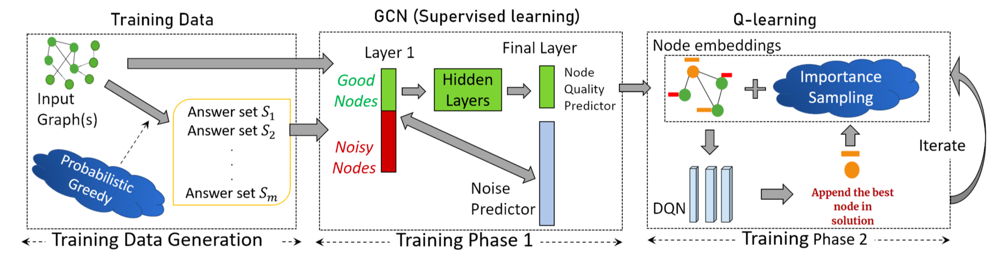
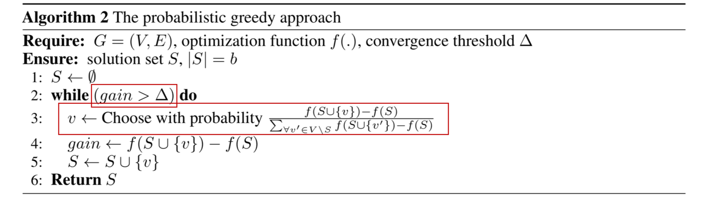
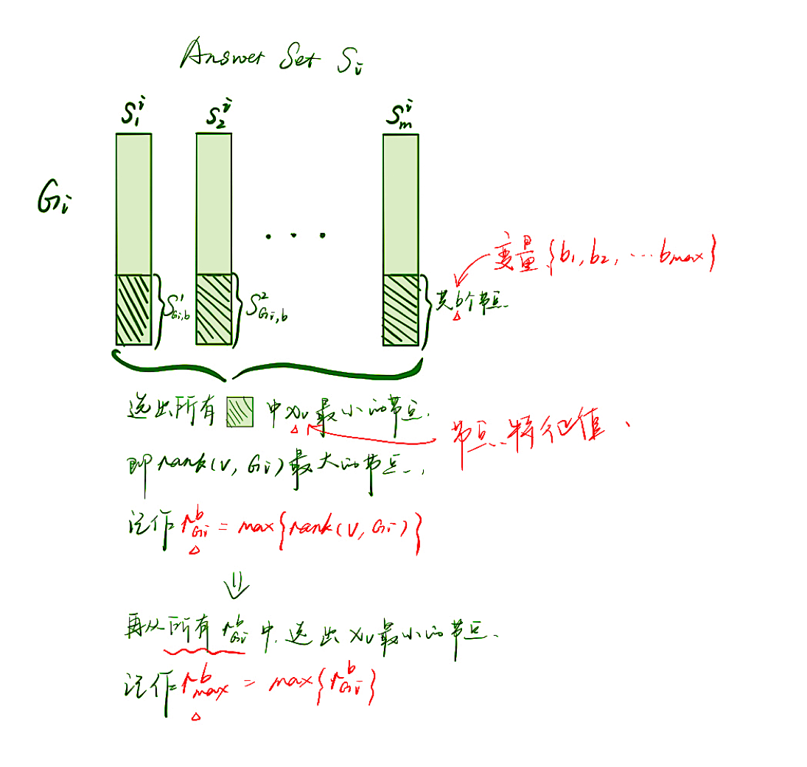
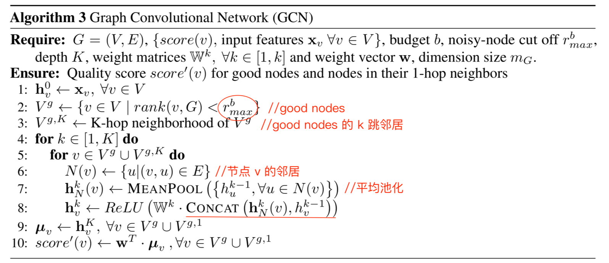
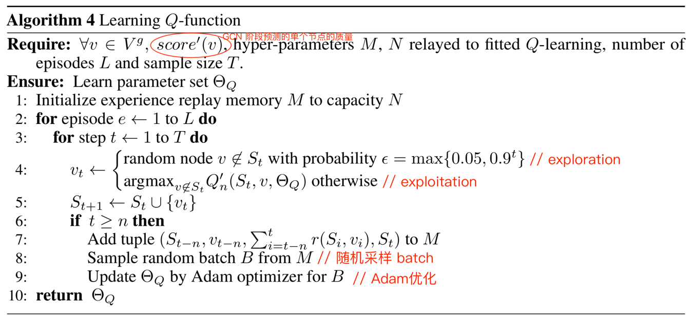

# GCOMB: Learning Budget-constrained Combinatorial Algorithms over Billion-sized Graphs 

## 0 论文信息

**作者**：Sahil Manchanda, Akash Mittal, Anuj Dhawan

**会议**：NeurIPS‘ 20

**Code**: Tensorflow, https://github.com/idea-iitd/GCOMB

## 1 论文背景

==**已有解决方案**==

S2V-DQN

GCN-TREESEARCH

==**存在的问题/局限**==

**可扩展性：**GCN-TREESEARCH 和 S2V-DQN 的重点在获得尽可能接近最佳质量的解。但是在可扩展性上仅限于数十万个节点的图形。

**实用组合问题的可推广性：**GCN-TREESEARCH 是针对最大独立集问题（MIS）提出的方法。当组合问题不是 MIS 时，GCN-TREESEARCH 建议将问题映射到 MIS。但是对于不容易映射到 MIS 的问题（e.g. IM、TSP问题），其解的质量会受到影响。

**预算约束：**GCN-TREESEARCH 和 S2V-DQN 可解决组合问题的决策版本（e.g. 顶点覆盖），但没有进行预算约束。

## 2 模型

分三个阶段：

1 Training Data

2 GCN 监督学习

3 Q-learning 深度强化学习

### 2.1 阶段一: Training Data

**目的**：为后面 GCN 阶段生成训练数据及 ground truth。

**方法**：

1. 运行 m 次概率贪心算法 (Probabilistic Greedy) 得到 m 个节点解集。（论文中，$m=30,\ \Delta = 0.01$）

2. 每个节点的 score 计算为，$score(v)=\frac{\sum^m_i gain(v)}{\sum^m_i f(S_i)}$，用于第二阶段的 ground truth。其中，$gain(v)$ 表示节点 $v$ 在 $S_i$ 上的边际收益。

### 2.2 阶段二: Training the GCN

**目的**：

1. 确定不太可能成为解决方案集的一部分节点，并作为噪声；（Noise predictor） 

2. 学习节点质量 score 的预测模型。（Node quality predictor）

#### 2.2.1 Noise predictor

在上一阶段中，为每个图生成了 m 个种子集 $S_1,S_2,...,S_m$。

利用 GCN 的第一层信息并学习一个分类器来预测给定的预算 b，一个节点是否可以安全地修剪而不影响解决方案集的质量。

**符号定义**：

$b$ 表示给定的预算，为变量。

$x_v$ 表示节点 $v$ 出度边的权重之和，作为节点输入特征。

$S^i_j$ 表示图 $G_i$ 中根据第一阶段概率贪婪算法得到的第 $j$ 个种子集。

**方法**：

1. 根据节点特征 $x_v$ 对节点进行排序，$rank(v, G_i)$ 即表示节点 $v$ 在该图 $G_i$ 中的排序位置。
2. 对于给定的预算 $b$，$S_{j, b}^i$ 表示根据概率贪婪算法加入种子集 $S_j^i$ 的前 $b$ 个节点。($S_{j, b}^i \subseteq S_j^i$)
3. 得到，$r^b_{G_i} = max^m_{j=0}\{ max_{\forall v \in S_{b,j}^i}  \{{rank(v, G_i)}\}\}$，代表在图 $G_i$ 中所有在预算种子集内的排名最低的节点。
4. 则，$r^b_{G_i}$ 在所有训练图 $G_i$ 中的最低排名的节点，即为 $r_{max}^b = max_{\forall G_i} r^b_{G_i}$，它代表有可能被包含在预算 $b$ 的答案集中的任何节点的最低排名。
5. 因此，可以通过改变 $b$ 的值 $\{b_1, ..., b_{max}\}$，得到 $r_{max}^{b_i}$。其中，$b_{max} = max_{\forall G_i}\{max_{j=0}^m \{|S_j^i|\}\}$
6. 通过曲线拟合来预测任何（看不见的）预算 $b$ 的数据 $r_{max}^b$。

用曲线拟合对 $r_{max}^b$ 进行预测（线性插值）。

#### 2.2.2 Node quality predictor

### 2.3 阶段三: Q-learning

**Markov Decision Process**

- State 状态：$S_1 \rightarrow S_2 \rightarrow ... \rightarrow S_b$

- Action 活动：将节点 $v$ 加入种子集

- Policy 策略：在状态 $S_t$ 中将哪个节点加入种子集 $S_{t-1}$

- Reward 奖励函数：边际收益

- Q~n~ 函数：表示加入节点 $v$ 后获得的 $n$ 步奖励和
  - 两个对 IM 组合问题的解有较大影响的因素
    - **节点自身质量**，即 score‘ 值
    - **节点的位置**，即 2 个有较多重合邻居的节点都加入种子集大概率不是个好的选择，loc 值，$loc(v, S_t) = |N(v) \diagdown \bigcup_{\forall u \in S_t} N(u) |$
  - 每个节点的**标签**向量 $\mu_v$，即为 $[score'(v), loc(v, S_t)]$
  - 候选节点集的**标签**为 $\mu_{C_t} = MAXPOOL\{ \mu_v | v \in C_t\}$
  - 种子集的**标签**为 $\mu_{S_t} = MAXPOOL\{\mu_v|v \in S_t\}$
  - $\mu_{C_t, S_t, v} = CONCAT(\theta_1·\mu_{C_t}, \theta_2·\mu_{S_t}, \theta_3·\mu_v)$
  - $Q'_n(S_t, v; \theta_Q) = \theta_4 · \mu_{C_t, S_t, v}$

- 损失函数 $J(\theta_Q) = (y-Q'_n(S_t, v_t; \theta_Q))^2$，其中，$y=\gamma·max_{v \in V^g}\{Q'_n(S_{t+n}, v; \theta_Q)\} + \sum_{i=0}^{n-1} r(S_{t+i}, v_{t+i})$

