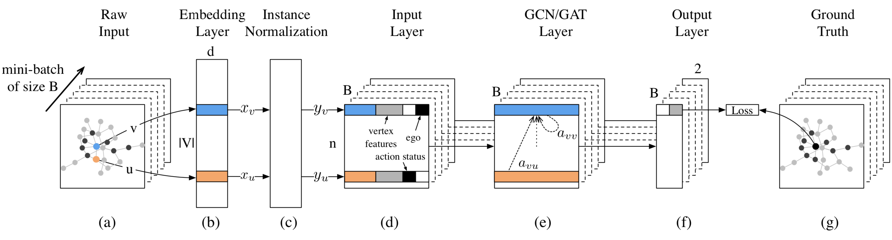

# DeepInf: Social Influence Prediction with Deep Learning

# 0 论文信息

**Author**：Jiezhong Qiu, Jian Tang, Hao Ma, Yuxiao Dong, Kuansan Wang, and Jie Tang

**Conference**：KDD' 18

# 1 背景

微观预测

# 2 问题表述

**r-neighbors**

$\Gamma_v^r = \{u:d(u,v) \leq r\}$，其中 $d(u,v)$ 表示节点 uv之间的最短路径长度。

**r-ego network**

$G_v^r$ 是 r-neighbors 的诱导子图。

**social action**

$s_u^t \in \{0,1\}$，$s_u^t =1$ 表示节点 $u$ 在 $t$ 时刻及之前执行了某 action。

**social influence locality**

社交影响局部性，用户的社会决策和行为仅受到网络内近邻的影响，而假设外部来源不存在。

给定 $G_r$，$S_t = \{s_u^t : u ∈ \Gamma^r_v \backslash \{v\}\}$，社会影响局部性旨在量化 $v$ 在给定时间间隔 $\Delta t$ 后的激活概率：$P(s^{t+∆t}_v |􏰍G^r_v,S^t_v)$

**问题定义**

给定 $N$ 个三元组 $(v,a,t)$，$v$ 是一个用户,  $a$ 是一个社交行为，$t$ 是一个时间戳.

对于任意三元组 $(v,a,t)$，同样给出节点 $v$ 的 r-ego network $G_v^r$，以及节点 $v$ 在未来时刻 $t+\Delta t$ 的动作状态 $s^{t+\Delta t}_v$。

将社交影响预测制定为二元图分类问题，可以通过最小化以下负对数似然目标来解决：

$L(Θ)=− \sum_{i=1}^N log(P_{\theta}(s_{v_i}^{t_i+\Delta t} | G_{v_i}^r, S_{v_i}^{t_i}))$

# 3 模型框架

## 3.1 采样

若采用 BFS 对不同的节点进行采样，则 $G_v^r$ 的大小可能不同，这种不同大小的数据不适合大多数深度学习模型。

因此采用带重启的随机游走，获得 **r-neighbors**  $\overline \Gamma_v^r$，**r-ego network** $\overline G_v^r$

## 3.2 神经网络

神经网络模型的输出是用户 $v$ 的隐藏表示，然后用于预测她的动作状态 $s^{t+\Delta t}_v$。

本文提出的神经网络模型由一个网络嵌入层、一个实例归一化层、一个输入层、几个图卷积或图注意层和一个输出层组成。

### 3.2.1 Embedding Layer

使用预训练的嵌入层，将用户 u 映射到她的 D 维表示。

### 3.2.2 Instance Normalization

实例归一化是最近提出的图像风格转移技术。

对于每个节点 $u$ 嵌入后的表征 $x_u$，其实例归一化后的值 $y_u$ 如下，

$y_{ud} = \frac{x_{ud}-\mu_d}{\sqrt{\sigma_d^2 + \epsilon}}$

其中 $d = 1, · · · , D$

$\mu_d = \frac{1}{n} \sum_{u \in \overline\Gamma_v^r x_{ud}}$

$\sigma_d^2 = \frac{1}{n} \sum_{u \in \overline\Gamma_v^r }(x_{ud}-\mu_d)^2$

这里 $μ_d$ 和 $σ_d$ 是均值和方差，而 $ε$ 是数值稳定性的一个小数。 直观地说，这种归一化可以消除特定于实例的均值和方差，这鼓励下游模型关注用户在潜在嵌入空间中的相对位置，而不是他们的绝对位置。 实例归一化有助于**避免训练期间的过度拟合**。

### 3.2.3 Input Layer

输入层为每个用户构造一个特征向量。 除了来自上游实例归一化后的节点嵌入特征外，它还考虑了两个二进制变量。 第一个变量表示用户的动作状态，另一个表示用户是否是自我用户。

### 3.2.4 GCN

$H^′=GCN(H)=д􏰉A(G)HW^⊤+b􏰊, (5)$

$A_{GCN}(G) = D^{−1/2}AD^{−1/2}$

### 3.2.5 GAT

$A_{GAT}(G) = [a_{ij}]_{n×n}$

$e_{ij} =attn􏰉(Wh_i,Wh_j􏰊)=LeakyReLU􏰉(c^⊤[􏰋Wh_i||Wh_j])􏰌􏰊$

为了使顶点之间的系数具有可比性，采用 softmax 函数对注意力系数进行归一化。

$a_{ij} = softmax(e_{ij}) = 􏰄\frac{exp(e_{ij})}{\sum_{k∈\overlineΓ^1_i} exp(e_{ik})}$

综上所述，归一化的注意力系数可以表示为，

$a_{ij} = 􏰄\frac{exp(LeakyReLU􏰉(c^⊤[􏰋Wh_i||Wh_j])􏰌􏰊)}{\sum_{k∈\overlineΓ^1_i} exp(LeakyReLU􏰉(c^⊤[􏰋Wh_i||Wh_k])􏰌􏰊)}$

多头即为，

$H^′ =g(Aggregatee(A_1(G)HW^⊤_1,···,A_K(G)HW^⊤_K􏰊)+b􏰊$

### 3.2.6 Output Layer and Loss Function

为每个用户输出一个二维表示，将用户的表示与 ground-truth 进行比较，然后优化对数似然损失。

## 4 实验设置

**数据集**

 

**数据准备**

1. 正负实例不平衡

   对于在某个时间戳 $t$ 受到影响执行社交动作 $a$ 的用户 $v$，生成一个正例。

   对于受影响用户 $v$ 的每个邻居，如果在观察窗口中从未观察到它处于活动状态，创建一个负实例。

   我们的目标是区分正例和负例。

   为了处理不平衡问题并展示我们的模型在捕获局部结构信息方面的优越性，我们过滤掉了很少有活动邻居的观察。特别是，在每个数据集中，我们只考虑自我用户拥有 ≥ 3 个活跃邻居的情况。

2. 标签不平衡

   采样了一个更平衡的数据集，负正比为 3:1。

**评价指标**

Prediction Performance：曲线下面积 (AUC) 、精度 (Prec.)、召回率 (Rec.) 和 F1-Measure (F1)

Parameter Sensitivity：分析了模型中的几个超参数，并测试不同的超参数选择如何影响预测性能。

Case Study：使用案例研究来进一步证明和解释 DeepInf 框架的有效性。

**比较方法**

逻辑回归 (LR)

支持向量机 (SVM)

PSCN：将社会影响预测建模为图分类问题，将其运用到最先进的图分类模型上。
