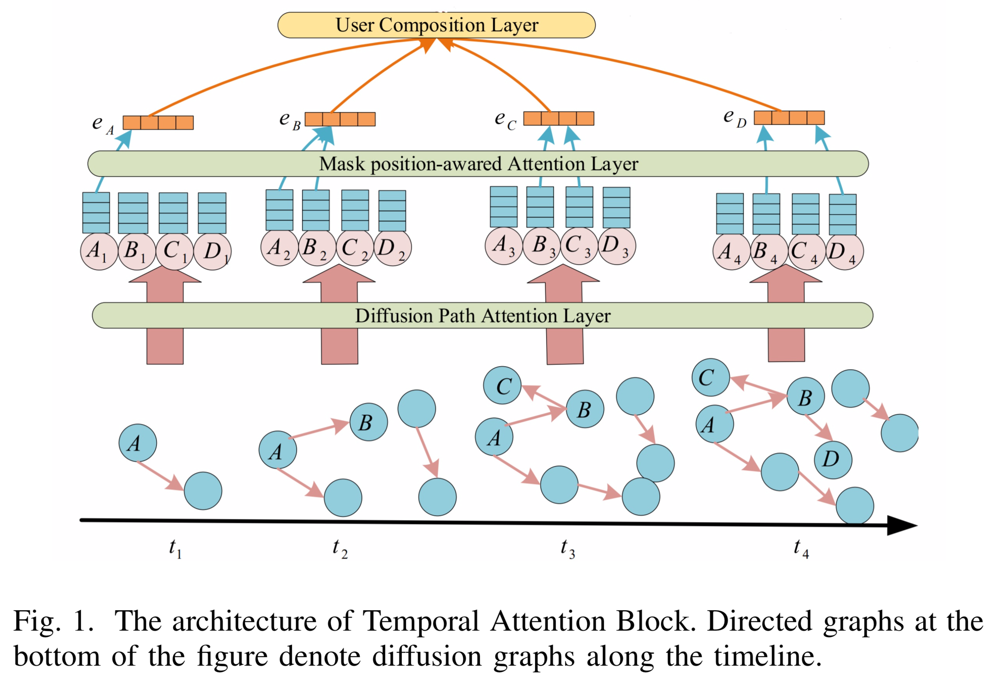

# Information Diffusion Prediction via Dynamic Graph Neural Networks

## 0 论文信息

**Author**: Zongmai Cao, Kai Han, Jianfu Zhu

**Conference**: CSCWD' 21 (CCF C)

## 1 背景

现有的研究要么只专注于利用传播路径或利用社交网络，而没有同时考虑两个重要方面：

1. 利用单一来源的信息将减少。
2. 他们没有认识到用户偏好变化的影响。 直觉上，用户感兴趣的内容会随着时间的推移而变化，他或她喜欢的消息可能不再吸引他或她。 因此，考虑用户不断变化的偏好是有益的。

## 2 预备知识

**时间间隔**

将时间轴 $[t_{min}, t_{max}]$ 划分为 $L$ 个时间间隔。

**传播序列**

给定一个在社交网络上传播的信息项 $U$ 的集合。对于每个信息项 $i \in U$，都有一个传播序列 $s_i = {(v_1, t_{v_1})), ..., (v_T , t_{v_T} )}$，用 $idx_v$ 代表时间戳 $t_v$ 属于哪个时间间隔，用 $Lookup(·)$ 函数进行计算，$idx_v = Lookup(t_v)$。

因此，重写传播序列为，$s_i = \{(v_1 , idx_{v_1} ), ..., (v_T , idx_{v_T})\}$。

**扩散图**

传播项 $i$ 的在第 $K$ 个时间间隔的传播图为 $D_i(k) = \{V,E_i(k)\}$，其中 $E_i(k) = \{(u,v)|(u,v) ∈ E,t_u < t_v,idx_u ≤ idx_v = k\}$。

为了更好地表征用户的动态偏好，我们将所有信息项视为一个整体，使用所有扩散序列一起构建扩散图。第 $K$ 个时间间隔的扩散图记为 $D(k) = \{V,E(k)\}$，沿时间线的一系列扩散图快照记为 $D = \{D(k)|k = 1， 2, ..., L\}$。

**问题定义**

给定一个社交图 $G$ 和所有信息项扩散序列 $S = {s_i|∀i ∈ U}$，学习一个扩散预测模型 $M$，它能够预测下一个将被感染的用户，即 $v_k$，当给定扩散序列 $s = {(v_1, t_1), ..., (v_{k-1}, t_{k-1})}$。

## 3 DySTGNN模型

DySTGNN 有两个主要构建块，（1）时间注意块和（2）结构聚合块。

### 3.1 时间注意块

时间注意块旨在生成用于预测下一个受感染用户的时间上下文。时间上下文应该利用扩散图在时间间隔内表征用户的偏好。

时间注意块由扩散路径注意层和掩蔽位置感知注意层和用户组合层组成，如图所示。

**扩散路径注意力层**捕获用户之间的交互，为每个用户生成偏好嵌入，代表用户在当前时间间隔内的偏好。

**掩码位置感知注意力层**聚合来自不同时间间隔的偏好嵌入，从而产生表征用户偏好演变的时间嵌入。

**用户组合层**融合了来自不同时间间隔的用户的时间嵌入，以生成预测下一个受感染用户的上下文。根据给定的扩散序列，选择用户嵌入的时间间隔取决于用户的感染时间。我们将在下面详细描述这三层。

#### 3.1.1 扩散路径注意力层

**输入1**

扩散图 $D = \{D(k)|k = 1, 2, ..., L\}$，用 $A^k$ 来表示 $D(k)$ 的邻接矩阵。

归一化边权重使得 $\sum_{􏰁(u,v)∈E(k)} A^k(u, v) = 1$

**输入2**

用户的偏好嵌入 $\{z_v^l ∈ R^{d_z} , ∀v ∈ V, l = 1, ..., L\}$，其中 $d_z$ 是嵌入的维度。 嵌入可以设置为节点属性或由正态分布随机初始化。

**GAT**

将扩散路径注意层设置为 GAT 的变体。GAT 可以作为聚合器，使用注意机制对邻居嵌入的贡献进行不同的加权。

$f^k_{uv} = σ(A^k(u,v)·a^T[W^sz^k_u||W^sz^k_v]),∀(u,v)∈E(k)$

$\alpha_{uv}^k = \frac{exp(f^k_{uv})}{\sum_{(w,v) \in E(k)}exp(f^k_{wv})}$

$z_v^k = \sigma (\sum_{(u,v) \in E(k)} \alpha_{uv}^k W^sz^k_u)$

其中，$W^s ∈ R^{{d_s}×d}$，$α ∈ R^{2d_s}$，系数 $α_{uv}$ 暗示节点 $u$ 在当前时间间隔内对激活节点 $v$ 的贡献。

#### 3.1.2 掩码位置感知注意力层

为了进一步捕捉相邻扩散图之间的扩散演化模式，设计了一个掩码位置感知注意力层。

**输入**

节点 $v$ 的一系列偏好嵌入，记为 $\{z_v^1, z_v^2, ..., z_v^L\}, z_v^k ∈ R^{d_s}$，是扩散路径注意力层的输出。

**输出**

每个节点 $v$ 的时间嵌入序列，表示为 $\{e^1_v,e^2_v,...,e^L_v\},e^k_v ∈R^{d_e}$

