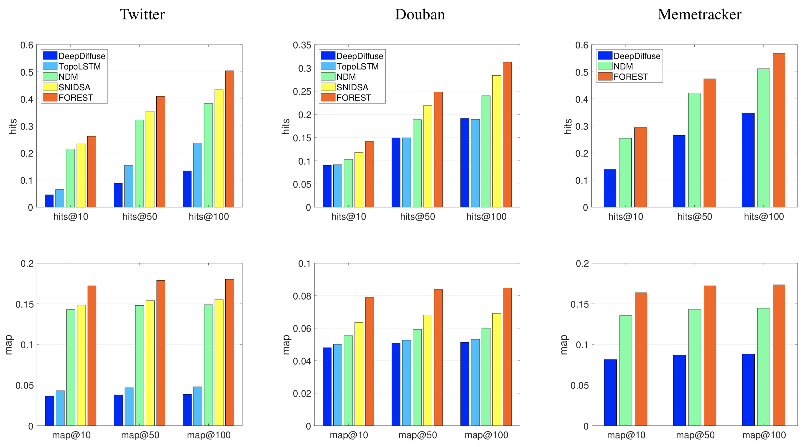
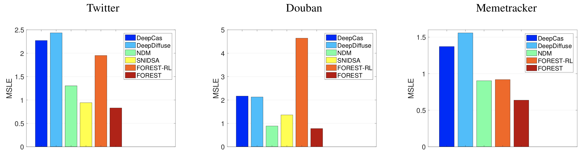

# Multi-scale Information Diffusion Prediction with Reinforced Recurrent Networks

## 0 论文信息

**Author**: Cheng Yang, Jian Tang, Maosong Sun, Ganqu Cui and Zhiyuan Liu

**Conference**: IJCAI' 19

## 1 背景

首次提出一个统一的微观和宏观尺度模型。

**相关技术**:

**a. Embedding-based Methods**

**b. RNN-based Methods**

 

## 2 问题定义

图 $G = (V,E)$，用户集合 $V$，级联集合 $C$，每个级联 $c_i \in C$ 都是一个用户序列 $\{ v_1^i, v_2^i, ..., v_{|c_i|}^i \}$ 

**Microscopic Diffusion Prediction** 在级联 $c_i$ 中，给定前 $k$ 个用户 $\{v_1^i,v_2^i ...,v_k^i\}$，预测下一个受感染用户 $v_{k+1}^i$ 

**Macroscopic Diffusion Prediction** 给定前 $k$ 个用户 $\{v_1^i,v_2^i ...,v_k^i\}$，预测级联大小

## 3 Method

1. 提出一种新颖的结构上下文提取算法，以构建基于 RNN 的微观级联模型。 

2. 通过强化学习将宏观预测能力（即估计级联的最终大小）纳入模型。

### 3.1 微观级联建模

#### 3.1.1 循环网络

采用门控循环单元(GRU)作为模型的基础。

给定级联序列 $\{v_1, v_2, . . , v_k\}$，GRU 将用户 $v_t$ 作为输入，并在每一步 $t = 1,2...,k$ 计算隐藏状态 $h_t$。

$h_t = GRU(h_{t−1},x_{v_t})$

#### 3.1.2 结构上下文提取

基于邻域采样的有效结构上下文提取算法

1. 从 $v$ 及其邻居 $N(v)$ 中采样 $Z$ 个用户 ${u_1,u_2 ...,u_Z}$。 
2. 通过聚合邻域特征来更新特征向量。

$f_v^{(1)} = relu(W \frac{1}{Z} \sum_{k=1}^Z f_{u_k^{(0)}} + b)$

### 3.2 微观扩散预测

将“最近感染的用户”定义为最后 m 个用户$\{v^i_{k-m+1}, v^i_{k-m+2}, ..., v^i_k\}$，进一步将特征向量聚合为 $s^i_k = mean(f_{v^i_{k-m+1}} ,f_{v^i_{k-m+2}} ,...f_{v^i_{k}} )$

最后，下一个受感染用户的概率是，

$p_k^i = softmax(W_p · concat(h^i_k, s^i_k) + b_p)$

其中 $p^i_k \in R|V|$ 是所有用户的多项概率分布，

微观扩散预测的训练目标是最大化所有级联的对数似然,

$J_{micro(\theta)} = \sum_{i=1}^{|C|} \sum_{k=1}^{|c_i|-1} log\ p^i_k [v_{k+1}^i]$

### 3.3 宏观级联建模

分为四个步骤：

a. 通过微观级联模型对观察到的 K 个用户进行编码；

b. 使微观级联模型能够通过级联模拟来预测级联的大小；

c. 使用均方对数变换误差 (MSLE) 作为宏观预测的监督信号；

d. 采用强化学习框架通过策略梯度算法更新参数。

 

#### 3.3.1 编码观察到的用户

将观察到的 $c_i$ 的 $K$ 个用户输入到微观级联模型中，并得到最后一个隐藏状态 $h^i_K$

此外，对位置信息进行了显式编码，使模型知道每一步有多少用户被输入到 GRU。

具体来说，我们为每一步 $t = 1, 2, ..., maxlen$ 分配一个位置嵌入 $POS_t \in R^{d_{pos}}$。其中 $maxlen$ 是级联的最大长度。 

在 GRU 的第 $t$ 步，我们将用户嵌入 $x_{v_t}$ 和位置嵌入 $POS_t$ 连接为输入向量。

#### 3.3.2 宏观预测的级联模拟

在每个级联的末尾附加一个虚拟用户 $<STOP>$，并要求模型也对其进行预测。

为了估计给定前 $K$ 个受感染用户的级联大小，根据公式中的预测概率分布递归地对用户进行采样。

把它作为下一个输入，做进一步的预测。 一旦 $<STOP>$ 信号被预测，我们可以将已经预测的用户数作为级联的最终大小。这种级联模拟将被处理多次以减少估计的方差。

#### 3.3.3 宏观预测的监督信号

虽然修改后的微观级联模型可以通过**模拟**来预测级联的大小，但该模型仍然没有监督信号来指导更好的性能。 在本文中，采用了均方对数变换误差 (MSLE)。

$MSLE= \frac{1}{􏰍|C|} (log(|c_i|)−log(pred_i))^2$

级联大小估计中使用的**采样**操作是不可微的，因此无法通过反向传播更新参数。为了克服这个问题，我们将模拟过程放入强化学习（RL）框架中，然后采用策略梯度去更新参数。

#### 3.3.4 参数更新的策略梯度

将 GRU 及其隐藏状态（包括结构上下文）映射到 RL 中的 **agent** 和 **state** 概念。

每个步骤的 **action** 是选择下一个受感染的用户，并且在给定当前 **state** 的情况下决定动作概率的策略由$p_k^i = softmax(W_p · concat(h^i_k, s^i_k) + b_p)$ 定义。

当下一个 **action** 是 $<STOP>$ 时，将给出 MSLE 的相对数作为奖励。

形式上，对于级联 $c_i$ 的大小预测，将 $c_i$ 的前 $K$ 个用户输入到微观级联模型中，最后一个隐藏状态 $h^i_K$ 作为 RL 的初始状态。对于每个动作序列 $seq = \{a_1, a_2 ... a_{maxlen}\}$ 其中 $a_j$ 是第 $j$ 个动作中选择的用户，可以通过 MSLE 的相反数（相对数）计算奖励 $reward(seq,c_i)$。 然后的目标是最大化对级联 $c_i$ 的奖励期望。

$J_{RL}^i(\theta) = \sum_{seq}Pr(seq; \theta, h_K^i)reward(seq, c_i)$

其中 $Pr(seq; \theta, h_K^i)$ 是选择动作的概率。

## 4 实验

### 4.1 数据集

 

训练集：测试集：验证集=8:1:1

### 4.2 Baselines

**微观级联预测模型：**
**TopoLSTM** 通过将隐藏状态构建为从社交图中提取的有向无环图来扩展标准 LSTM 模型。
**DeepDiffuse** 采用嵌入技术和注意力模型来利用感染时间戳信息。实验中用感染步骤替换时间戳，因为数据集中没有确切时间戳。
**NDM** 基于自注意和卷积神经网络构建了一个微观级联模型，以缓解长期依赖问题。
**SNIDSA** 计算所有用户对的成对相似性，并通过门控机制将结构信息合并到 RNN 中。

**宏观级联预测模型：**
**DeepCas** 是最先进的级联大小预测算法，它同时考虑了级联信息和底层社交图谱。

### 4.3 实验设置

**微观预测**

将下一个受感染用户预测视为一项检索任务，方法是根据公式中的感染概率对未感染用户进行排名。报告平均精度 (MAP) 和 HITS 分数。 

**宏观预测**

给定级联中的前 K = 5 个用户来预测级联的大小。使用 MSLE 进行评估。此外，通过将附加的 $<STOP>$ 信号附加到训练级联，采用所有微观基线进行宏观级联大小预测。

### 4.4 实验结果

1. FOREST 在微观扩散预测方面始终优于所有最先进的基线方法，在 HITS 和 MAP 分数方面相对提高了 10% 以上。与 TopoLSTM 和 SNIDSA 相比，改进主要来自结构上下文的编码。 FOREST 的结构上下文提取算法考虑了二阶邻域，而以前的工作只考虑了一阶邻域。
2. FOREST 在级联尺寸预测方面始终优于其他基线，包括最先进的宏观扩散预测方法 DeepCas，在 MSLE 方面相对提高了 12% 以上。与去除宏观尺寸预测的强化训练的 FOREST-RL 相比，FOREST 通过结合宏观监督信号进行参数训练，实现了更有希望和更稳健的性能。
3. 与 DeepCas 相比，微观级联模型能够利用训练数据中的更多信息，即详细的感染用户及其感染顺序。因此，微观级联模型能够在宏观扩散预测任务上给出可比甚至更好的结果。这一发现将鼓励微观级联模型在未来的工作中取代宏观级联模型。
4. 我们省略了FOREST-RL 和FOREST-RL 在微观预测中的消融研究，因为RL 对微观预测的益处不如宏观预测那么显着（图5 中相对改善了30%-80%）。这是因为强化学习侧重于长期建模，而微观预测（下一个受感染的用户预测）是短期的。我们将考虑未来工作的长期微观预测设置。

