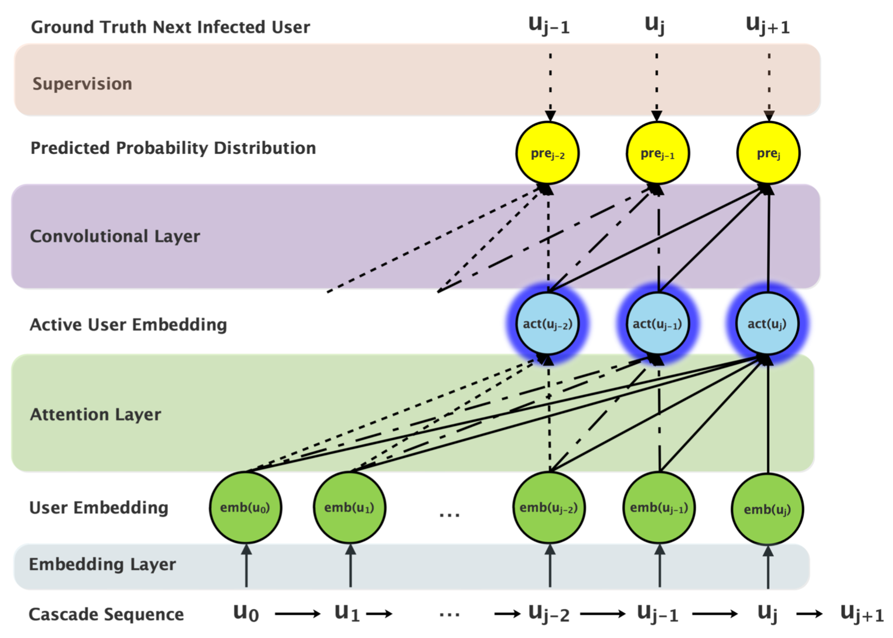

# Neural Diffusion Model for Microscopic Cascade Study

## 0 论文信息

**Author**: Cheng Yang, Maosong Sun, Haoran Liu, Shiyi Han, Zhiyuan Liu, Huanbo Luan

**Conference**: TKDE' 2019

## 1 论文背景

在大多数扩散过程中，例如产品的采用或病毒的传染中，扩散图是未知的。因此，现有方法考虑了一个更简单的问题，并且不能推广到扩散图未知的一般设置。

因此，本文首次尝试将深度学习技术用于**扩散图未知**的一般微观级联研究。

微观级联研究的相关工作可以分为三类：

- 基于 IC 的方法
- 基于嵌入的方法
- 基于深度学习的方法。

## 2 数据观察

对现实世界的数据集进行数据观察，并研究扩散序列中激活用户之间的内在关系。

连续激活的用户是否更有可能相关，从而一起出现在更多的扩散序列中。

### 2.1 数据集

 

**Lastfm**

是一个音乐流媒体网站。包含近 1,000 名用户的完整历史记录以及他们一年多听过的歌曲。将每首歌曲视为在用户中传播的一个项目，并删除收听不超过 5 首歌曲的用户。

**Irvine** 

是加州大学欧文分校的学生在线社区。学生可以参与并在不同的论坛上发帖。将每个论坛视为一个信息项，并删除参与不超过 5 个论坛的用户。

**Memetracker**

收集了一百万条新闻故事和博客文章，并跟踪最常见的引用和短语，即 meme，用于研究 meme 在一群人中的迁移。每个 meme 被认为是一个信息项，每个网站或博客的 URL 被认为是一个用户。过滤 URL 以仅保留最活跃的 URL，以减轻噪声的影响。

**Twitter**

关注包含 2010 年 10 月在 Twitter 上发布的 URL 的推文。收集每个 URL 的完整推文历史。将每个不同的 URL 视为 Twitter 用户的传播项目。过滤掉不超过 5 条推文的用户。

> 由于没有用户之间的交互图信息，因此假设如果两个用户出现在相同的级联序列中，则它们之间存在链接。

 

### 2.2 统计分析

尝试通过统计结果揭示用户之间的相关模式。凭直觉，级联序列中的两个连续感染用户更有可能建立连接，例如一个人感染另一个人，因此一起参与了许多其他的扩散序列。

为了证明这一说法，考虑以下统计数据：鉴于用户 $u_i$ 和 $u_j$ 在级联序列中被感染，并且在此序列中他们之间感染了 $K$ 个用户，那么用户对共同参与的级联序列数量的期望是多少？这里 $K = 0$ 表示用户 $u_i$ 和 $u_j$ 被连续激活。如果直觉是正确的，那么期望应该随着 K 的增加而减小。

## 3 METHOD

在本节中，我们将从形式化问题和介绍符号开始。 然后我们根据数据观察提出两个启发式假设作为我们的基础，并使用深度学习技术设计一个神经扩散模型（NDM）。 最后，我们将介绍我们模型的整体优化功能和其他细节。

### 3.1 问题描述

只考虑用户被感染的顺序，而忽略了本文中感染的确切时间戳。

给定用户集 $U$ 和观察级联序列 $C$，每个级联 $c_i \in C$ 包含了用户序列 $\{ u_0^i, u_1^i...u_{|c_i|-1}^i \}$ (按照被感染时间排序，即只考虑用户被感染的顺序，而忽略了本文中感染的确切时间戳)

目标是学习一个级联模型，该模型可以在给定部分观察到的级联序列 $\{u_0 , u_1...u_j\}$ 的情况下预测下一个受感染用户 $u_{j+1}$。 学习到的模型能够根据前几个观察到的受感染用户预测整个受感染用户序列。

在模型中，将一个名为“Terminate”的虚拟用户添加到用户集 U。在训练阶段， “Terminate” 被附加到每个级联序列的末尾，并允许模型将下一个受感染用户预测为“Terminate”，以指示在此级联中不会再有用户被感染。

将用户 u 的嵌入表示为 $emb(u) \in R^d$，其中 $d$ 是嵌入的维度。在模型中，两个用户的嵌入之间较大的内积表明用户之间的相关性更强。 通过将用户投影到相应的向量中，嵌入层作为模型的底层。

 

### 3.2 模型假设

**假设 1.**  给定一个最近被感染的用户 $u$，与用户 $u$ 强相关的用户，包括用户 $u$ 本身，更有可能是活跃的。

**定义 1.**  对于每个最近被感染的用户 $u$，我们的目标是学习一个活跃用户嵌入 $act(u) \in  R^d$，它表示与用户 $u$ 相关的所有活跃用户的嵌入，可用于预测下一步的下一个感染用户。

**假设 2.**  所有最近感染的用户都应该对下一个感染用户的预测做出贡献，并根据被感染的顺序进行不同的处理。

### 3.3 注意力机制

**注意力机制**

使用注意力机制，通过给予他们比其他用户更多的权重来提取最有可能的活跃用户。 如图所示，用户 $u_j$ 的活跃性嵌入被计算为先前被感染用户的加权和，

$act(u_j) = 􏰂 \sum_{k=0}^j w_{jk}emb(u_k)$

其中，$u_k$ 的权重为，

$w_{jk} = \frac{􏰁exp(emb(u_j)emb(u_k)^T)}{\sum_{m=0}^j exp(emb(u_j)emb(u_m)^T)}$

其中，$w_{jk} \in (0, 1)$，$\sum^j_{m=0} w_{jm} = 1$，$w_{jk}$ 是 $u_j$ 和 $u_k$ 的嵌入之间的归一化内积，表示它们之间的相关强度。

与 $emb(u_j)$ 具有较大内积的用户嵌入 $emb(u_k)$ 将被分配较大的权重 $w_{jk}$。这个公式自然遵循我们的假设，即与用户 $u$ 强相关的用户，包括用户 $u$ 本身，应该受到更多关注。

**多头注意力**

$head_i = \sum_{k=0}^j w_{jk}^iemb(u_k)W_i^V$

其中，权重为，

$w^i_{jk} = \frac{exp(emb(u_j)W^Q_i(emb(u_k)W^K_i)^T)} {\sum^j_{m=0} exp(emb(u_j)W_i^Q(emb(u_m)W_i^K)^T)}$

则，活跃性嵌入表示为，

$act(u_j) = [head_1,head_2 ...head_h]W^O$

### 3.4 卷积层

卷积层首先通过特定位置的线性投影矩阵 $W_n^C \in R^{d \times |U|}$ 将每个活跃用户嵌入 $act(u_{j-n})$ 转换为 $|U|$ 维向量。然后卷积层对投影向量求和，并通过 softmax 函数对求和进行归一化。

形式上，给定部分观察到的级联序列 $(u_0, u_1 ... u_j)$，预测概率分布 $pre_j \in R^{|U|}$ 为，

$pre_j = softmax(\sum_{n=0}^{win-1} act(u_{j−n})W_n^C)$

$pre_j$ 代表相应用户在下一步被感染的概率。

由于初始用户 $u_0$ 在整个扩散过程中起着重要作用，我们进一步考虑 $u_0$：

$pre_j = softmax(\sum_{n=0}^{win-1} act(u_{j−n})W_n^C + act(u_0)W^C_{init} \cdot F_{init})$

### 3.5 模型细节

最大化所有观察到的级联序列的对数似然以构建整体优化函数。

$L(Θ) = 􏰂\sum_{c_i \in C} \sum_{j=0}^{|c_i|-2} log\ pre^i_j[u^i_{j+1}]$

## 4 实验

略