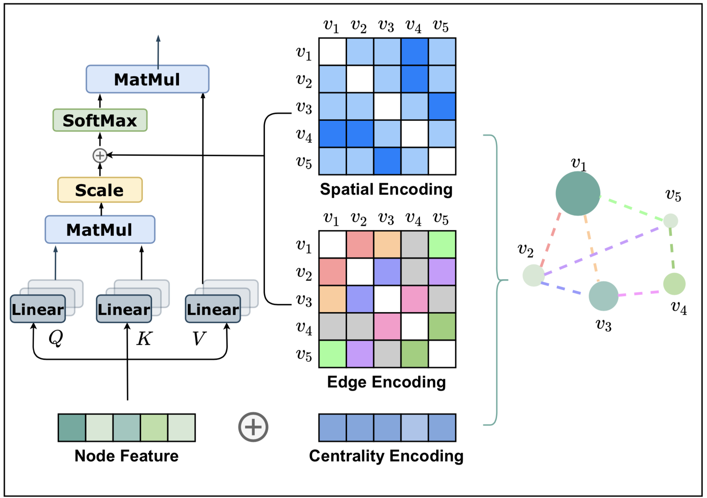

# Graphormer

## 1 Centrality Encoding

用图的出度和入度来表示节点的向心性，并使用下列式子引入：

$h_i^{(0)} = x_i + z^-_{deg^-(v_i)}+z^+_{def^+(v_i)}$

## 2 Spatial Encoding

对于序列信息来说，为了获得序列中的空间信息，Transformer会引入Position embedding来编码序列中的空间信息。

而对于图结构来说，节点并没有组织成序列。节点可能存在于多维空间，并通过边相连。为了在模型中编码图的空间信息，Graphormer提出了Spatial Encoding。

用一个函数 $\phi(v_i, v_j)$ 表示图中节点对之间的关系，文中用最短路径shortest path (SPD) 来衡量两个相连节点之间的距离。

则，$A_{ij}$ 有，

$A_{i,j} = \frac{(h_iW_Q)(h_jW_K)}{\sqrt{d}} + b_{\phi(v_i, v_j)}$

其中 $b_{\phi(v_i, v_j)}$ 为 $\phi(v_i, v_j)$ 索引的可学习的标量，在所有Layer上共享。

## 3 Edge Encoding

对于每个有序的节点对 $(v_i, v_j)$ ，找到之 $(v_i, v_j)$ 间的最短路径：$SP_{ij}=(e_1,e_2,...,e_N)$ ，然后计算沿路径的 edge feature 与可学习的 embedding 的点积的平均值，如下式所示：

$A_{i,j} = \frac{(h_iW_Q)(h_jW_K)}{\sqrt{d}}+b_{\phi(v_i, v_j)}+c_{i,j}$

$c_{ij}=\frac{1}{N} \sum_{n=1}^N x_{e_n}(w_n^E)^T$

其中$x_{e_n}$是在路径中$SP_{ij}$的第$n$个edge，$w_n^E \in R^{d_E}$为第![[公式]](https://www.zhihu.com/equation?tex=n)个可学习的 embedding。

## 4 Layer

$h'^{(l)}=MHA(LN(h^{(l-1)}))$

$h^{(l)}=FFN(LN(h'^{(l)}))+h'^{(l)}$

