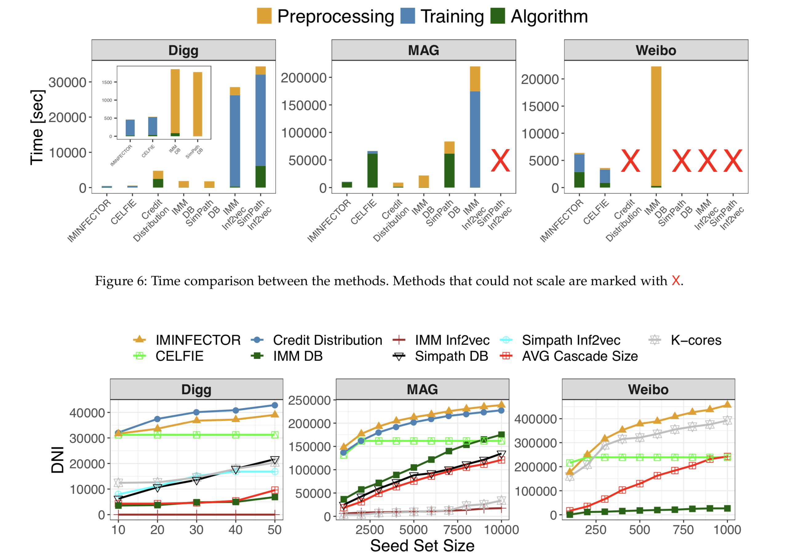

# Multi-task Learning for Influence Estimation and Maximization

## 0 论文信息

**Author**: George Panagopoulos, Fragkiskos D. Malliaros, and Michalis Vazirgiannis

**Conference**: TKDE' 21

## 1 背景

提出了 **IMINFECTOR**（**I**nfluence **M**aximization with **INF**luencer v**ECTOR**s），这是一种使用从**扩散级联**中学习影响最大化的方法。

## 2 INFECTOR

### 2.1 Node-Context Extraction

**节点分类**

希望影响者在共享内容时表现出与普通节点不同的特征，因此对节点进行排序，并分为3类，作为模型输入的特征。

利用新浪微博数据集的级联，根据出现时间分为训练和测试级联，每个级联代表一条推文及其一组转推。

根据三个衡量标准对在测试集中发起级联的所有用户进行排名：==节点产生的测试级联的数量==、==累积级联大小==以及==受影响的不同节点 (DNI) 的数量==。

根据节点在每个指标上的表现将节点分为三类，并且对于每个类别，计算节点在训练集中开始的级联数（即作为源节点），以及他们参与级联的级联数。

结果如下图，与属于中低类别的用户相比，属于顶级类别的用户更容易创建级联。这意味着与普通用户相比，影响者开始级联的可能性更大。

 

由于最终目标是找到影响者，因此只专注于级联的发起者（源节点）即可。

此外，微博中的影响者更倾向于创建而非参与级联，因此可以忽略他们出现在其他级联中的情况。

**从级联中提取上下文**

影响者 u 的上下文通过对 u 开始的给定级联 c 中的所有节点 v 进行采样，每个节点 v 的采样概率与节点 v 转发 u 的时间成反比，转发越快，被采样进 u 的上下文中的概率越高。具体采样概率公式为 $P(v|C_u) \sim \frac{(t_u-t_v)^{-1}}{\sum_{v' \in C_u}(t_u-t_v')^{-1}}$

### 2.2 INFECTOR Model

INFECTOR 模型，使用多任务神经网络同时学习**影响者和转发者之间的扩散概率**以及**影响者创建长级联的能力**。

给定一个输入节点 u，第一个任务是对它将影响的**节点进行分类**，第二个任务是**预测它将创建的级联的大小**。

**输入**

INFECTOR 模型有两种类型的输入，第一个是**影响者-上下文对**，第二个是**影响者-级联大小对**。

 

**输出**

1. 第一个输出表示源节点 u 对网络中节点 v 的扩散概率 pu,v。它是通过 softmax 函数创建的，其损失函数是交叉熵。

2. 第二个输出旨在回归级联长度，该长度相对于该集合中的其余级联进行了 min-max 归一化，因此使用 sigmoid 函数将输出限制在 (0, 1) 处。

 

Ou 是通过将 u 的 one-hot 向量与嵌入矩阵 O 相乘来检索的。

### 2.3 INFECTOR 创新点

1. 它计算扩散概率并且不需要底层社交网络，这与直接分配给网络边缘的影响概率形成对比。

2. DP 是易感节点出现在由影响者发起的扩散中的概率，与网络中两个节点的距离无关。这种方法捕获了 v 出现在 u 的级联中，z 出现在 v 的级联中但不在 u 的级联中的情况。
3. DP 能够克服由扩散模型在 IM 中重复模拟的计算瓶颈。

 

## 3 IMINFECTOR

### 3.1 用影响力向量进行传播

从网络导出的 DP 可以定义一个矩阵：
$$
D=
\left[
\begin{array}{c}
    f_t(O_1T)\\
    ...\\
    f_t(O_IT)
\end{array}
\right]
$$
剪枝：根据模型对各节点的级联大小预测，来保留前 P% 的节点集作为候选节点集。

利用候选种子 u 的嵌入$|O_u|$来预测该节点将影响的节点数，即为：$\lambda_u = \lceil N\frac{||O_u||_2}{\sum_{u' \in I}||O_{u'}||_2} \rceil$

通过模型，已经获得源节点对其上下文各节点的影响传播概率（DP）表示为 $D_u$，将其排序得到 $\hat{D}_u$

此时选择 top $\lambda_u$ 个 $\hat{D}_u$，求和即为影响力延展度的大小，$\sigma' (s)=\sum_j^{\lambda_s} \hat{D}_{s,j}$

### 3.2 IMINFECTOR

CELF 的改变版本，相当于将 CELF 中 MC 模拟获取节点边际影响力部分，进行了替换，替换为本文用 INFECTOR 模型求得的候选节点对其余节点的**扩散概率**之和。每找到一个种子节点后，都会将该种子节点 s 影响到的节点 v 从别的候选节点中删除节点 v ，以此来体现“边际”的概念。

 

## 4 实验

### 4.1 实验设置

**数据集**

 

**Baseline**

将传统算法扩展到本文的设定

• K-CORES
• AVG CASCADE SIZE
• SIMPATH：一种启发式方法
• IMM：参数 ε 设置为 0.1
• CREDIT DISTRIBUTION：该模型使用级联日志和网络边缘来分配影响信用并导出种子集（参数 λ 设置为 0.001）。
• CELFIE
• IMINFECTOR：我们提出的模型完全基于级联，嵌入大小等于 50，以 0.1 的学习率训练了 5 个 epoch。微博和MAG的剪枝百分比P设置为10，Digg设置为40。

### 4.2 实验结果

## 5 缺点

对于该模型，任何不同的图，都需要重新进行预处理和模型训练，再进行预测任务。因为该模型是用级联来学习每个源节点的特征，再进行预测任务的，所以一旦更换图，则级联将完全不同。

而用强化学习则一般不需要重新训练。