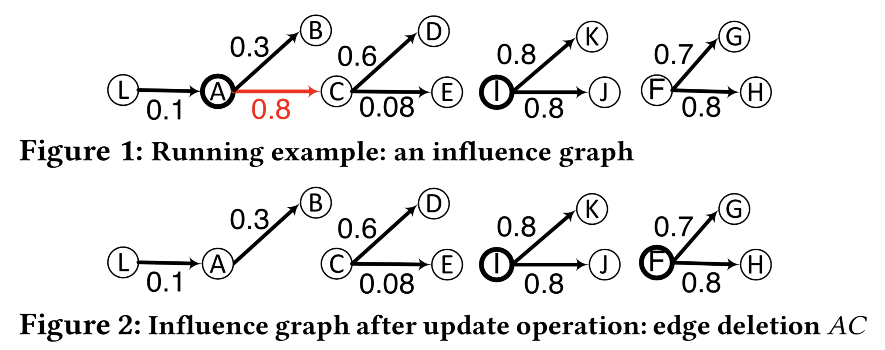
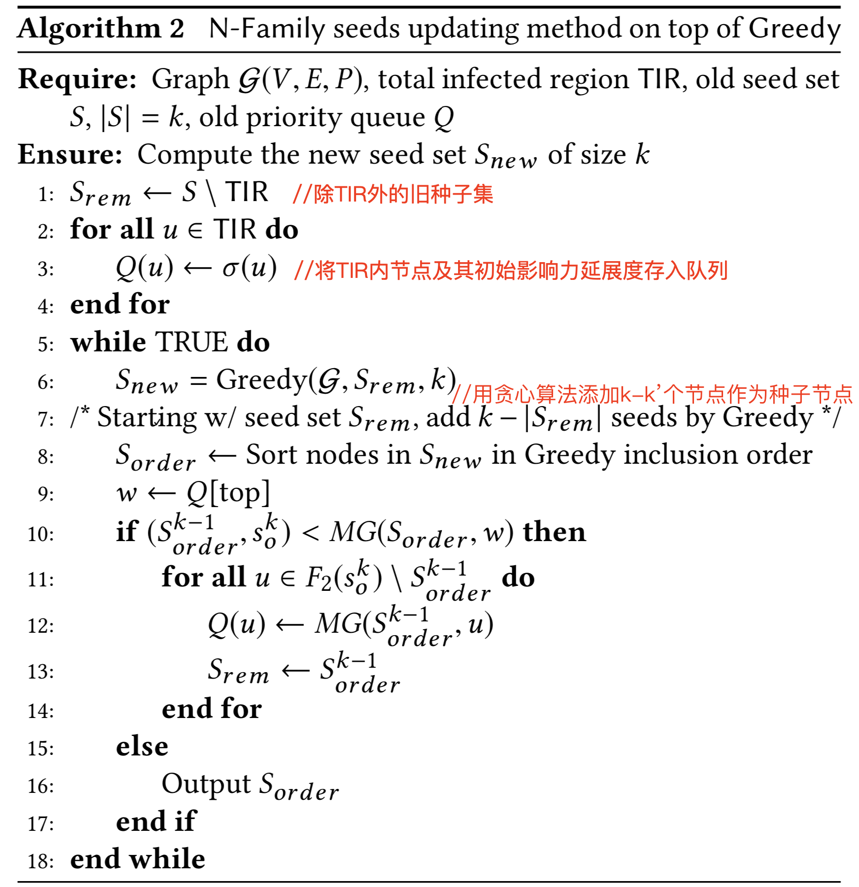

# Fast Influence Maximization in Dynamic Graphs: A Local Updating Approach

## 0 论文信息

**Author**: Vijaya Krishna Yalavarthi, Arijit Khan

NTU

## 1 论文背景

动态图中的影响力最大化。作者先检测图变化后受影响的区域（节点），再根据受影响区域更新种子节点。

## 2 PRELIMINARIES

最大影响路径 $MIP(u,v)= \arg \max_{Pt \in P(u,v)} \{\prod_{e \in Pt} P_e \}$

最大影响入度树 $MIIP(u, \theta) = \bigcup_{v \in V} \{ MIP(v, u): \prod_{e \in MIP(v, u)} P_e \geq \theta \}$

最大影响出度树 $MIOP(u, \theta) = \bigcup_{w \in V} \{ MIP(u, w): \prod_{e \in MIP(u, w)} P_e \geq \theta \}$

边际影响力 $MG(S,u) = σ(S ∪ {u}) − σ(S)$

## 3 IM in Dynamic Graphs

动态图的更新操作共有6种：

1. increase in edge probability 增加边概率
2. adding a new edge 添加新边
3. adding a new node 添加新节点
4. decrease in edge probability 减小边概率
5. deleting an existing edge 删除边
6. deleting an existing node 删除节点

将上述更新操作分为两类：

1. additive updates（包括1、2、3种）
2. reductive updates（包括4、5、6种）

## 4 Finding Affected Regions

### 4.1 N-Family

**1-Family**

$F_1(u) = MIIA(u,θ) ∪ MIOA(u,θ)$

**2-Family**

$F_2(u)= ∪_{w \in F_1(u)} F_1(w)$

 

> 令 $θ = 0.07$
>
> 则有 $pp(\{C\}, C) = 1, \ pp(\{A\},C) = 0.8,  \ pp(\{L\},C) = 0.8 × 0.1 = 0.08$.
>
> $MIIA(C,0.07) = \{C,A,L\}$
>
> $MIOA(C,0.07) = \{C,D,E\}$
>
> $F_1(C) = \{C,A,L,D,E\}$
>
> $F_2(C) = \{C,A,L,D,E,B\}$

**N-Family**

$F_N(u)= ∪_{w \in F_{N-1}(u)} F_1(w)$

**N-Family 的含义**

- 节点 u 的变化，只会引起 $F_N(u)$ 内节点影响力的变化。

- 考虑 s ∈ S，从种子集 S 中删除 s 不会改变任何不在 F2(s) 中的节点的边际增益。

### 4.2 N-IR

**First infected region (1-IR)**

对于一个更新操作 $o$，$1-IR(o)$ 是一组节点，其影响力延展度的改变范围大于等于 $\theta$

$1-IR(o)=\{v∈V:|σ_G(v)−σ_{G,o}(v)|≥ \theta \} = MIIA(u,θ)$ (文中将 $MIIA(u,θ)$ 作为其代替) 

> 在图1 中，令 $θ =0.07$，移除边 AC，$1-IR(o)=MIIA(A,0.07)=\{A,L\}$

**Second infected region (2-IR)**

additive 更新操作表示为 $o_a$，reductive 更新操作表示为 $o_r$

对于 o~a~，1-IR(o~a~) 中存在的每个节点的影响范围都会增加，这使得 1-IR 中的任何节点都有可能成为种子节点。 因此，存在于 1-IR(o~a~) 中的所有节点的 2-Family 的联合被称为第二个感染区域 2-IR(o~a~)。

对于 o~r~，1-IR(o~r~ ) 中任何节点的影响力传播都没有增加。 因此，存在于 1-IR(o~r~) 中的旧种子节点 2-Family 的联合被认为是第二个感染区域 2-IR(o~r~)。

$2-IR(o_r) = {F_2(s) : s ∈ 1-IR(o_r ) ∩ S} $

$ 2-IR(o_a) = {F_2(u) : u ∈ 1-IR(o_a)}$

> 在图1中，令 $θ =0.07$，移除边 AC，$2-IR(o)=F_2(A)$。这是因为 A 是存在于 1-IR(o) 中的旧种子节点，用于此还原更新。 此外，因为这是一个还原更新，所以需要在更新之前计算 A 的族。 因此，$2-IR(o)=F_2(A) = \{A,B,C,D,L,E\}$。

**N^th^ infected region (N-IR)**

$N-IR = \{F_2(s) : s ∈ F_2(u) ∩ S,u ∈ (N-1)-IR\}$

**Total infected region (TIR)**

$TIR = 1-IR \ ∪\ 2-IR\ ∪\ 3-IR\ ∪\ . . . until termination$

## 5 Updating the Seed Nodes

 

## 6 思考

**IM in Dynamic Network with Multi-task DRL**

1. 动态网络

​		动态网络的变化可以分为 3 种：**节点增加**、节点减少、边概率变化（包括边增加与边减少）

2. 多任务 DRL

​		可以学习：影响力预测、种子节点选择、网络变化引起的影响区域探测

