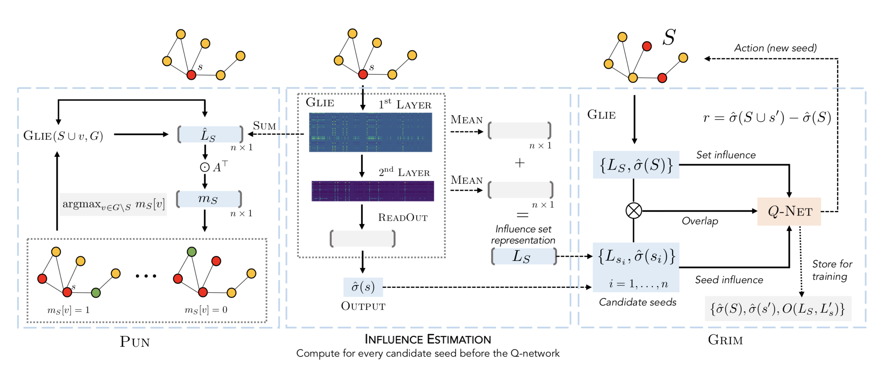

# Learning to Maximize Influence

> 用 GNN 对个节点的影响力大小进行预测，对排好序的节点用 RL 进行节点选择（决策过程）

## 0 论文信息

**Author**：George Panagopoulo, Nikolaos Tziortziotis, Fragkiskos D. Malliaros, Michalis Vazirgiannis

**arXiv**：2021.10.6

## 1 论文背景

### 1.1 GCOMB

比较经典的一个 IM 结合强化学习的是 2020 年发在 NIPS上的 GCOMB 。

> 1. 利用概率贪婪算法在训练集的图上生成 score，再用这些 score 作为 Groud-Truth 用于 GNN 的训练。
>
> 2. 用一种基于度的噪声估计方法，来减少候选种子的数量。
>
> 3. 有了这些节点的 score，进行强化学习。

GCOMB 缺点：

> 必须在图的大量随机子集（30%）上进行训练，并对其余部分进行测试。这使得模型与图相关，当换了一个新图，之前训练得到的模型（参数）都不可用。

### 1.2 本文思路

> 第一阶段：用 GNN 对节点进行影响力估计。
>
> 第二阶段：用 CELF/强化学习 进行种子节点的选择（决策过程）。

## 2 模型

### 2.1 GLIE 模型

> 用 GNN 解决第一阶段的节点影响力预测。
>
> GLIE 的目的是学习如何估计种子集对图的影响。

**消息传递**

$A \in R^{n \times n}$ 表示邻接矩阵，有以下表示，其中 $deg(u)$ 表示节点的入度，$N(u)$ 表示节点的邻居节点，

$$
A_{uv} = p_{uv}=
\begin{cases}
\frac{1}{deg(u)}, \quad v\in N(u) \\
0, \quad \quad \quad   v\notin N(u) \\
\end{cases}
$$
 

$X \in R^{x \times d}$ 表示节点的特征，有以下表示，

$$
X_u =
\begin{cases} 
\{1\}^d, \quad u \in S \\
\{0\}^d, \quad u \notin S \\
\end{cases}
$$

则在扩散的第一步，可以用消息传递来计算的到该节点被种子集影响的上界 $\widehat {p}(u|S)$,

$$
\widehat{p}(u|S)=A_u·X = \sum_{v \in N(u)\bigcap S} \frac {1}{deg(u)} = \sum_{v \in N(u)\bigcap S}p_{uv} \geqslant 1-\prod_{v \in N(u)\bigcap S} (1-p_{uv}) = p(u|S)
$$

**layer**

若用 $H_t$ 来表示每个节点在第 $t$ 步的实际影响概率的上界，则有，

$H_1 = A·X$

$H_{t+1} = A·H_t$

由于消息传递本质上可以计算影响估计的近似值，因此可以将其参数化，来学习一个基于监督的函数来收紧这个近似值，

$H_{t+1}= ReLU([H_t, AH_t]W_0)$

**readout**

$H_S^G = \sum_{v \in V}[H_0^v, H_1^v,..., H_t^v]$

这种表示方法捕获了每一层中所有节点处于激活状态的概率。

**output**

$\widehat{\sigma} (S) = ReLU(H_S^G W_{0})$

### 2.2 CELF-GLIE 模型

>  即为 CELF with GLIE 模型，用 CELF 解决第二阶段的种子节点选择。

CELF 原本用作 IM 问题原始贪婪算法的加速。

在本文的模型中，作者对其进行了拓展，用 GLIE 的输出代替原始 CELF 中用 MC 计算得到的影响力大小的预测（**I**nfluence **E**stimate）。

CELF-GLIE 有两个主要的计算瓶颈：

> 1. 尽管它减轻了在每个步骤中测试每个节点的需要，但实际上它仍然需要在每个步骤中预测多个节点的影响力大小。

> 2. 第一轮需要计算每个节点的初始 IE 值。

### 2.3 GRIM 模型

>  用强化学习解决第二阶段的种子节点选择。

在每一步骤中只计算一个 IE，以及所有节点的初始 IE。

定义影响集为 $L_S \in \{0, 1\}^n$，可以通过每一层 $H_t$ 的激活量相加，并对其进行阈值化，即可得到一个二值向量，

$$
L_S = 1\{\sum_{t=0}^T \frac{\sum^{d_t}_{i=0} H_t^i}{d_t} \geqslant 0 \}
$$

其中，$T$ 表示层数，$H_t^i \in R^{n \times 1}$ 表示 $H_t$ 的一列，$d_t$ 表示该层输出向量的维度，$H_t$ 的维度为 $n \times d_t$，$L_S$ 向量也即为每个节点的其中一个标签（用来标记该节点是否被激活）。

利用这一点来计算当前种子集的影响与其他节点的初始影响之间的差异。

GLIE 为所有候选种子提供一个 IE，并将最高的节点添加到种子集，类似于 CELF-GLIE。保留了每个节点的初始影响集的列表，然后，Q-network 以当前种子集的估计影响 $\widehat{σ}(S)$、节点的初始影响 $\widehat{σ}(s)$ 以及节点 s 的边际收益作为输入，生成每个节点的 Q-value。

???+ done "边际收益"
    边际收益其实是候选节点与种子集之间的差，
    $O(S,s) = \sum_{i=0}^n 1\{L_s^i - L_S^i \geqslant 0 \}$

Q-network 即被称为 **G**raph **R**einforcement for **I**nfluence **M**aximization (GRIM)，有两层神经网络构成，

$Q(u,S,G)=ReLU(ReLU([\widehat{\sigma}_S, \widehat{\sigma}_s, O(S, s)] W_k)W_q)$

其中，$W_q \in R^{hd \times 1}$，hd 表示隐藏层的大小。

强化学习中用贪心策略选择下一个种子，即策略函数即为 $π(u|S) =argmax_{u∈S}Q(u, S, G)$

奖励函数即为，$r= \widehat{σ}(S∪u)−\widehat{σ}(S)$ ，$\widehat{\sigma}$是由 GLIE 预测得到的，而无需像之前的一些工作需要进行 MC 。

### 2.4 PUN 

> PUN 指潜在未受影响的邻居 （ Potentially Uninfluenced Neighbors）

由于上述算法需要为每个节点计算初始的影响力大小，这一步操作时非常耗时的，因此作者提出 PUN 的解决方法。

首先需要基于 GLIE 重新定义一个更为简单的影响集表示，同样地，也令其为 $\widehat{L}_S \in \{0, 1\}^n$，$\widehat{L}_S$ 为二值向量，

$$
\widehat{L}_S = 1\{\sum_{t=0}^{d_1} H_1^i \leqslant 0 \}
$$

$\widehat{L}$ 显然比 $L$ 更为简单，并提供了一个更粗略的估计。

由此可以得到一个节点尚未被激活的邻居节点的数量，

$m_S=A^T·\widehat{L}_S ∈ R^{n \times 1}$

使这个启发式最大化可以被认为是种子在其近邻上的边际收益的近似，

$\sigma_m (S) = \sum_{i=1}^{|S|}m_{S_i}$

下图实验用于观察 PUN 定义的 $\sigma_m$ 近似的性能，和 DMP 进行对比，可以看到 $\sigma_m$ 对影响力大小是低估的。但在时间上，确实更为高效地计算了节点的边际收益。

## 3 实验

### 3.1 影响力估计

#### 3.1.1 实验设置

**合成数据集**

数据集：100 个合成数据集（Barabasi-Albert、Holme-Kim ），节点大小分别为100-200个节点、300-500个节点。

边的概率：入度分之一

转为有向图：添加反向边

标记样本：蒙特卡洛 MC

{width=400}

#### 3.1.2 实验结果

1. 上表为所有数据集的平均误差和平均影响，以及平均时间。

2. GLIE 在计算时间上有显著的加速，检索到的种子也更有效。

3. Celf的大部分时间都消耗在对影响扩散的初始计算上。

### 3.2 影响力最大化

#### 3.2.1 实验设置

**训练数据集**：

50 个随机 BA 图。

**参数设置**：

$k=100, \ delay=2, \ episode=500, \ \epsilon = 0.3, \ decline\, factor=0.99$

**对照算法**：

IMM

#### 3.2.2 实验结果

1. 与其他方法相比，GLIE-CELF 表现出更高的影响力质量，但速度相当慢。

2. GRIM 比 GLIE-CELF 稍快。

3. 在影响质量和运行时间上，PUN都较为不错，因此可以说 PUN 提供了检验方法中准确性和效率之间的最佳权衡。

## 4 创新点

1. 框架。将框架拆分成两阶段，通过替换第二阶段寻找种子节点的框架，来得到不同的模型。会让工作看起来很丰富。

2. GRIM 模型中，因为引入了 GLIE，因此 Q-function 的设计显得新颖。

3. PUN 模型中，影响力延展度函数的设计。
