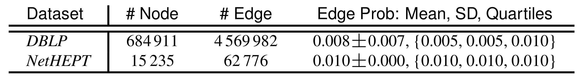
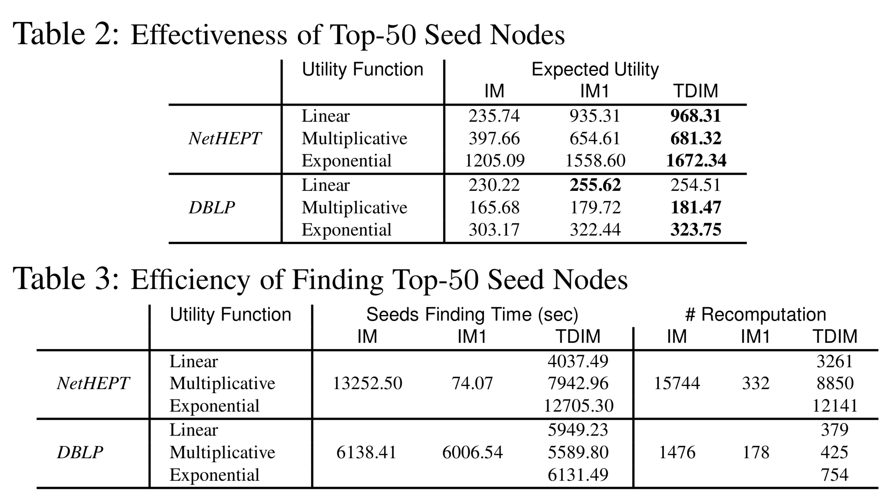

# Towards Time-Discounted Influence Maximization

## 0 论文信息

**Author**: Arijit Khan

**Conference**: CIKM '16

## 1 背景

Time-discounted influence maximization (TDIM) 时间折扣影响最大化

传播的事物具有时效性，越到后面，激活一个节点的意义就没有那么大了。

## 2 问题定义

给定一个图 $G(V, E, P)$ 和预算 $k$，$\Delta T(u,S)$ 表示节点 $u$ 被种子集 $S$ 激活所需的时间，是一个随机变量，令 $\delta t(u,S)$ 作为 $\Delta T(u,S)$ 的一个实现。定义一个与 $\delta t$ 有关的==效用函数== $U$，使得，
$$
arg \max_S 􏰃\sum_{u∈V} E[U(∆T(u,S))] \\

such \ that \ |S| = k
$$

关于效用函数，文中用了三种形式：

>  *Exponential*: $U(δt) = αδt$
>
> *Multiplicative*: $U(δt) = \frac{1}{\delta t+1}$
>
> *Linear*: $U(\delta t) = max\{1 − β × δt, 0\}$

## 3 TDIM 问题的属性

定理 1. TDIM 目标函数在 IC 模型下是**子模**且**单调**的

定理 2. TDIM 目标函数在 LT 模型下是**子模**且**单调**的

定理 3. TDIM 目标函数在 MIA 模型下是**子模**且**单调**的

## 4 算法

1、应用贪心算法

2、应用 CELF

## 5 实验

**数据集**：

 

**边概率**：

DBLP：如果两位作者合作 $c$ 次，则相应的边缘概率与：$1 − exp^{−c/10}$ 成正比。

NetHEPT：恒定边缘概率 0.01

**效用函数**：

*Exponential*: $U(δt) = αδt$

*Multiplicative*: $U(δt) = \frac{1}{\delta t+1}$

*Linear*: $U(\delta t) = max\{1 − β × δt, 0\}$

其中，$α = 0.9$ 、$β = 0.2$

**实验结果**：

 