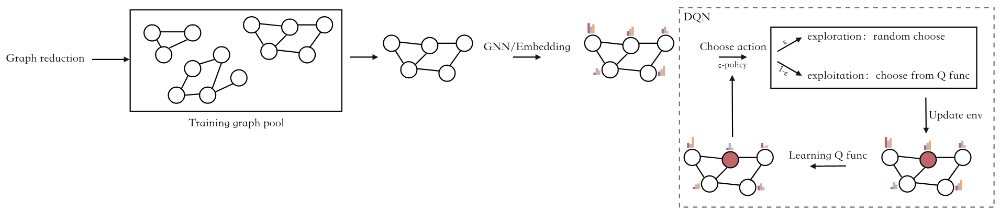

# Deep RL for IM in Signed Social Network

## 1 Background

**Goal**：最大化总奖励数

**Question**：如何得到每个状态下的最优动作，使得奖励最大化？

**Challenge**：$Q^*$ 能得到每个动作带来的平均回报，即 $a^*=\arg \max_a Q^*(s,a)$

**Solution**：学习一个 $Q$ 函数来近似 $Q^*$，$Q$ 函数即为动作价值函数

## 2 Solution

**传统强化学习**：得到一个 table，通过训练的方式，记录并更新每种动作下得到的回报 (奖励和)

**DQN**：Deep Q Network，用神经网络 $Q(s,a;w)$ 来近似 $Q^*(s,a)$

## 3 DQN

1. 观察状态 $s_t$ 和动作 $a_t$
2. 预测该动作下的 $Q$ 函数的值：==$q_t = Q(s_t, a_t; W_t)$==
3. 环境更新状态，给出动作 $a_t$ 的 reward $r_t$
4. 计算 TD target: ==$y_t = r_t + \gamma ·\max_a Q(s_{t+1},a_{t+1}; W_t)$== 
5. 进行梯度下降，更新参数：$w_{t+1}=w_t-(q_t-y_t)·d_t$

## 4 剪枝

将符号社交网络拆分成 G+ 和 G-，分别剪枝后，再合并。

## 5 IM in Signed Social Network

**影响力传播**

$f_{S \rightarrow j}^+ = \alpha^+(\sum_{i,j\in E^+} w_{i,j}f^+_{S \rightarrow i} \ + \ \sum_{i,j\in E^-} w_{i,j}f^-_{S \rightarrow i})$

$f_{S \rightarrow j}^- = \alpha^-(\sum_{i,j\in E^+} w_{i,j}f^-_{S \rightarrow i} \ + \ \sum_{i,j\in E^-} w_{i,j}f^+_{S \rightarrow i})$

$f_{S \rightarrow j} = f_{S \rightarrow j}^+ + f_{S \rightarrow i}^-$

**抽象成马尔可夫决策过程**

<u>State</u>:  $s = S$ ，小 s 代表当前状态，大 S 即为当前选为种子的节点。

<u>Action</u>:  $a = j$ 表示在状态 $s$ 下，选择了节点 $j$ 作为种子节点。

<u>Reward</u>:  奖励函数设计如下，

$$
\begin{align}
R_{a=j}&=f(S \bigcup j) - f(S)\\
&= f_{\{S \bigcup j\} \rightarrow V}^+ + f_{\{S \bigcup j \} \rightarrow V}^- - f_{S \rightarrow V}^+ - f_{S \rightarrow V}^-
\end{align}
$$

<u>Discounted Return</u>：折扣回报函数，

$$
\begin{align}
U_t &= R_t + \gamma R_{t+1} + \gamma^2 R_{t+2} + ... \\
&=R_t + \gamma U_{t+1}
\end{align}
$$

<u>Action-Value function</u>:  动作价值函数，

$$
Q(s_t, a_t)= E[U_t|s_t,a_t]
$$

$$
\underbrace{ Q(s_t,a_t;\theta)}_{predict}= \underbrace{ \underbrace{r_t}_{真实奖励}+ \underbrace{\gamma · Q(s_{t+1},a_{t+1};\theta)}_{predict}}_{TD \ target}
$$

