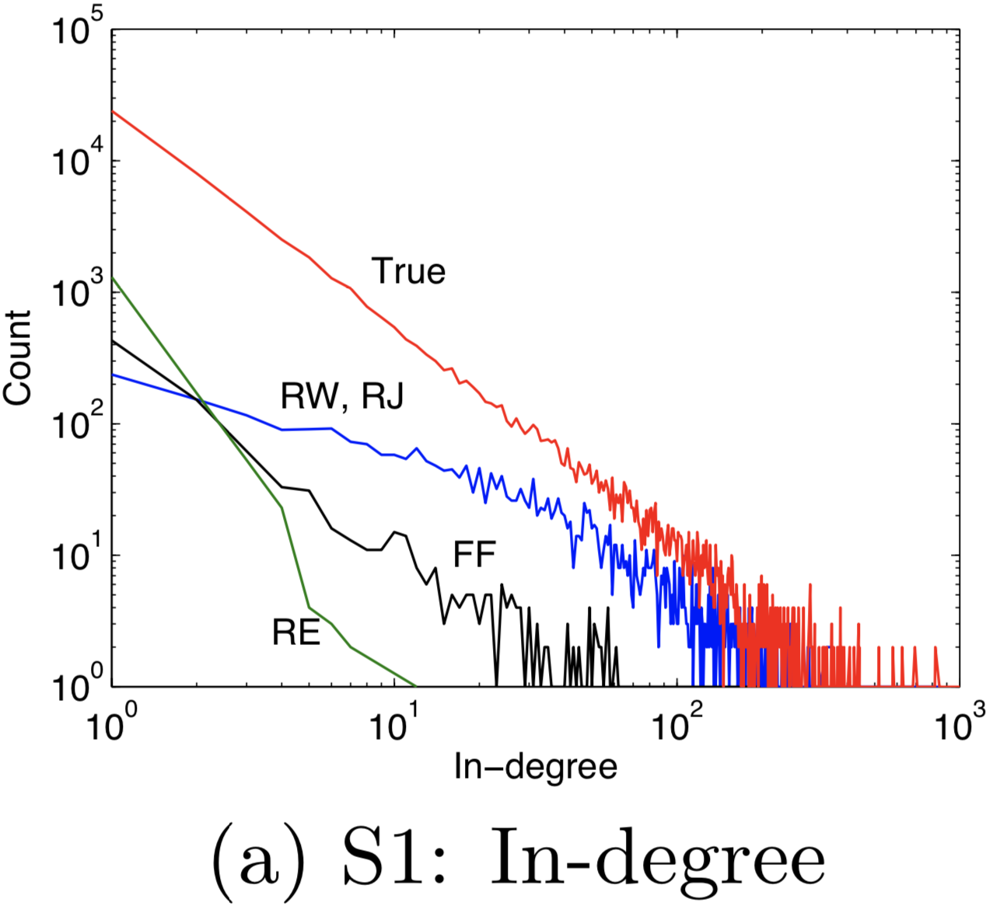
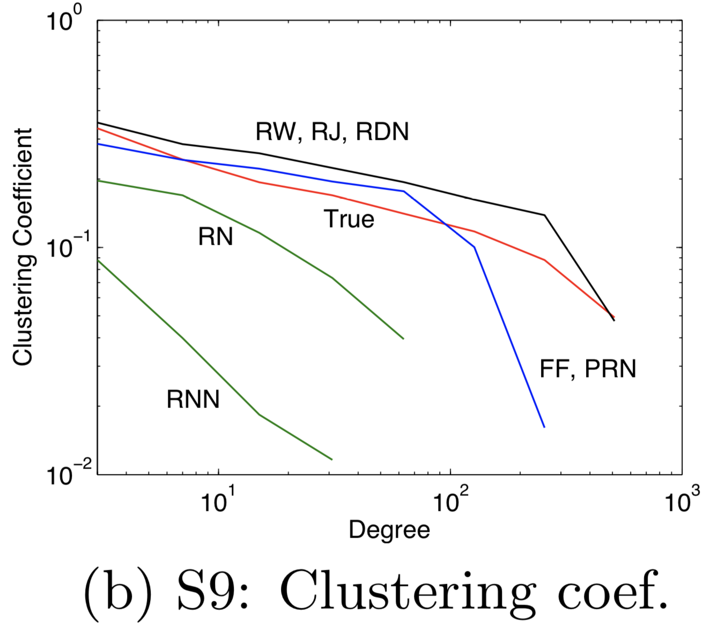
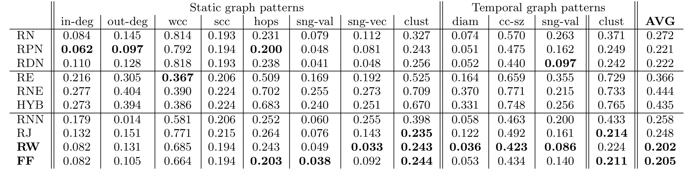
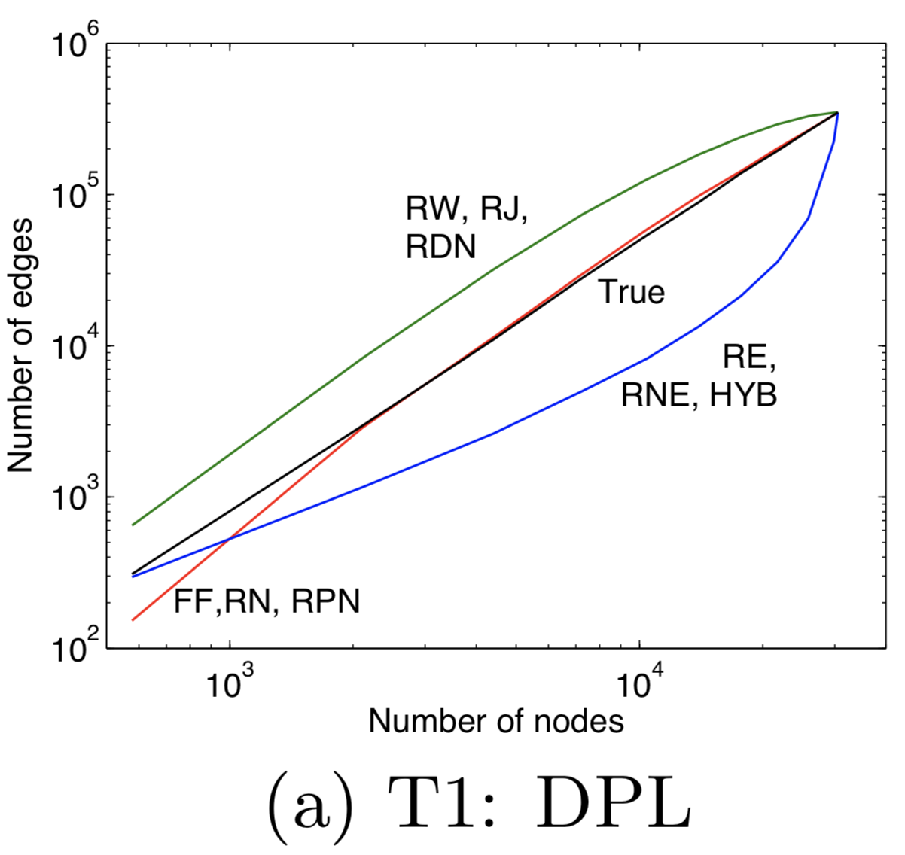
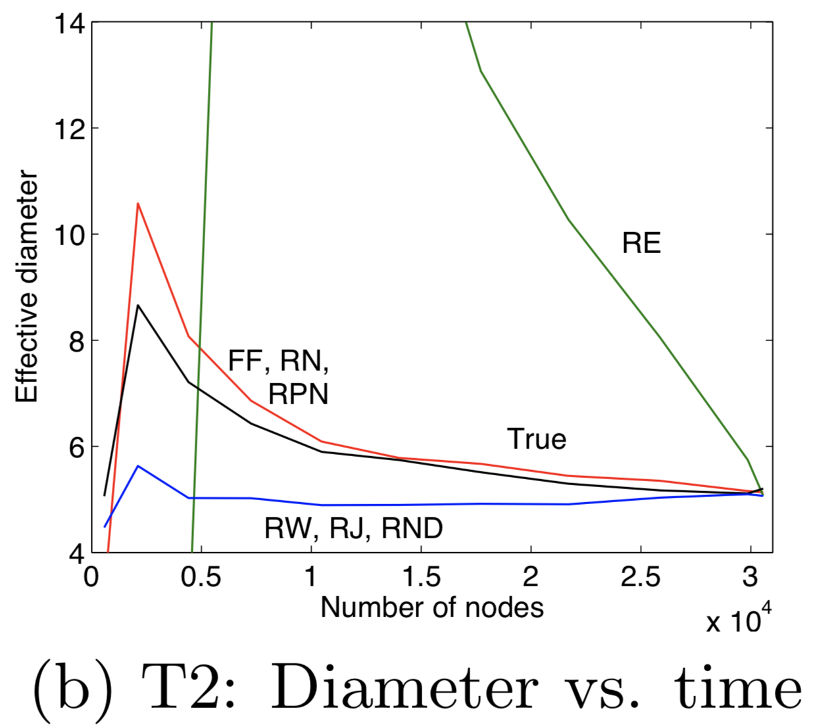
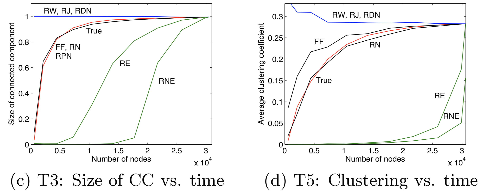
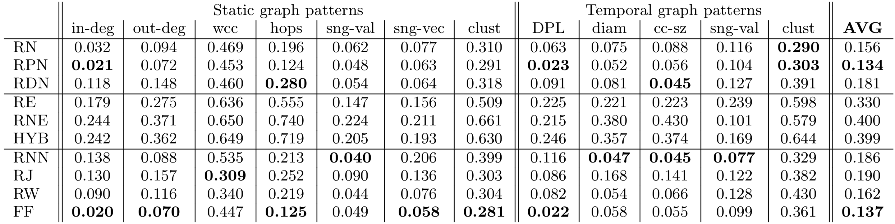
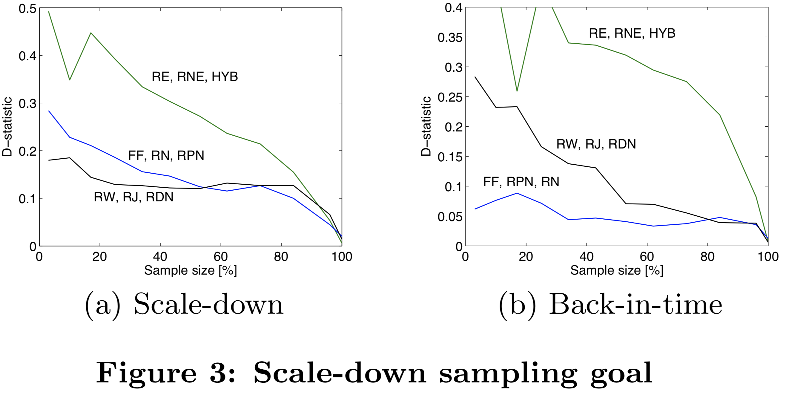
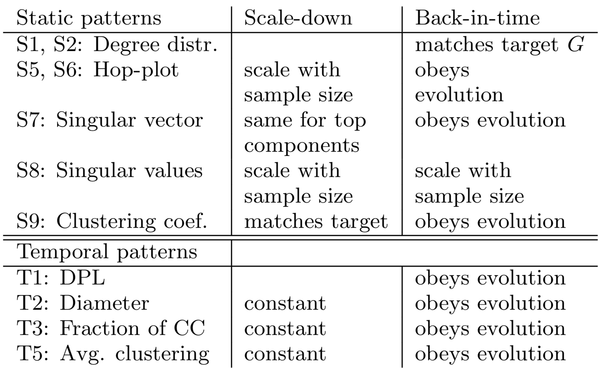

# Sampling from Large Graphs

## 1 论文信息

**Author**: Jure Leskovec, Christos Faloutsos

**Conference**: SIGKDD

## 2 背景

### 2.1 面临的问题：

1. 使用哪种抽样方法

2. 样本量可以有多小

3. 如何扩大样本的测量（例如，直径），以获得大图的估计

4. 如何衡量抽样方法的优劣？

### 2.2 对于问题 3 有两方面的思路：

1. 采样目标

   -  Scale-down 目标（静态图）

     与原始图 G 相比，样本图 S 具有相似的属性

   - Back-in-time 目标（动态图）

     样本 S 类似于图形 G 退化 (回溯) 在它具有 S 大小时的样子？

2. 应该注重图形属性的列表而非单个属性
   - 本文的目标不是为图的单个属性 (例如边数、直径) 找到采样程序和相应的无偏估计量。
   - 而是找到一种能够匹配全套图属性的通用采样方法，以便采样图可用于模拟和更复杂/昂贵的实验。

## 3 评价方法

### 3.1 静态图属性列表

- S1 入度分布
  - 对于每个度数 d，计算入度为 d 的节点数。
  - 通常该属性遵循幂律和其他一些重尾分布。

- S2 出度分布
- S3 弱连接分量 (wcc) 的大小分布
  - 节点集内任何一对节点 u 和 v，存在来自 (u,v) 的无向路径，则该组节点是弱连接的。
- S4 强连通分量 (scc) 的大小分布
  - 节点集内任何一对节点 u 和 v，存在一条从<u,v> 和 <v,u> 的有向路径，则该组节点是强连接的。
- S5 Hop-plot
  - 跳数小于 h 跳的可达节点对的数量 P(h)。
- S6 最大强连通分量上的Hop-plot。
- S7 图邻接矩阵的第一个左奇异向量与秩的分布。
- S8 图邻接矩阵的奇异值相对于秩的分布。
  - 该特性通常遵循重尾分布。
- S9 聚类系数 Cd 的分布
  - 设节点 v 有 k 个邻居，那么它们之间最多可以存在 k(k − 1)/2 条边。
  - 让 Cv 表示实际存在的这些允许边的比例。
  - 然后将 Cd 定义为度数为 d 的所有节点 v 上的平均 Cv。

### 3.2 动态图演化的标准

- T1 致密幂律 (DPL) 
  - 边数与节点数的关系。
  - DPL 表示为 $e(t) \varpropto n(t)^a$。
  - 致密指数 a 通常大于 1，这意味着图中节点的平均度数随时间增加。
- T2 图随时间变化的有效直径
  - 定义为所有已连接节点对的 90% 可以相互到达的最小跳数。
  - 据观察，有效直径通常会随着时间的推移而缩小或稳定。
- T3 最大连接组件 (CC) 随时间的标准化大小
- T4 图邻接矩阵随时间的最大奇异值
- T5 随时间变化的平均聚类系数 C
  - t 时刻的 C 是 t 时刻图中所有节点 v 的平均 Cv。

## 4 采样算法

从概念上讲，可以将采样算法分为三组：

- 随机选择节点
- 随机选择边
- 模拟随机游走或病毒传播

对于 Scale-down，基于随机游走的方法表现最好，而在 Back-in-time 中，“Forest Fire”表现最好。

### 4.1 随机选择节点

#### 4.1.1 随机节点采样 (RN) 

RN 不保留幂律度分布。

#### 4.1.2 随机 PageRank 节点采样 (RPN) 

将节点被选入样本的概率设置为与其 PageRank 权重成正比。

#### 4.1.3 随机度节点采样 (RDN)

一个节点被选中的概率与它的度数成正比。直觉上，这种方法在匹配度分布时会出现问题，因为样本中存在太多度高的节点。我们还希望它提供非常密集的样本。

### 4.2 随机边选择采样

#### 4.2.1 随机边采样 (RE) 

随机均匀地选择边

#### 4.2.2 随机节点边采样 (RNE)

首先均匀地随机选取一个节点，然后均匀地随机选取一个与节点相关的边。

#### 4.2.3 混合采样 (HYB) 

以概率 p 执行 RNE 采样步骤，并以概率 1 - p 执行 RE 采样步骤。当 p 设置为 0.8 时，其性能最佳。

### 4.3 探索采样

这一系列采样技术的共同思想是，首先随机均匀地选择一个节点，然后探索其附近的节点。

#### 4.3.1 随机节点邻居采样 (RNN)

随机均匀地选择一个节点及其所有传出邻居。

这适用于非常大的磁盘弹性图，因为它模仿读取边缘文件的方法。

可以很好地匹配出度分布，但无法匹配入度和社区结构。

#### 4.3.2 随机游走采样 (RW)

均匀地随机选取一个起始节点，然后在图上模拟随机游走。在每一步，以 c = 0.15 的概率回到起始节点并重新开始随机游走。

但该采样方法存在一个 stuck 的问题，例如，如果起始节点是 sink 或它属于一个小的、孤立的社区。解决方案是：如果经过很长的步骤后，没有访问足够的节点来满足所需的样本大小，则重新选择另一个起始节点并重复该过程。

在实验中，选择运行随机游走 100 * n 步。

#### 4.3.3 随机跳跃采样 (RJ)

与随机游走采样 (RW) 非常相似，唯一的区别是，以 c = 0.15 的概率随机跳转到图中的任何节点而非回道起始节点。

该算法不存在 stuck 或无法访问足够节点的问题。

#### 4.3.4 Forest Fire 采样 (FF)

1. 首先随机均匀地选择节点 $v$。

2. 生成一个随机数 $x$，它的几何分布为均值 $p_f /(1 − p_f )$。

3. 节点 $v$ 选择 $x$ 个尚未被访问的邻居节点 $u_1,u_2,...,u_x$ 。

4. 将这个步骤递归地应用到节点  $u_1,u_2,...,u_x$ 中。 

> 节点不能被第二次访问。
>
> 如果"火熄灭"，则重新启动，即随机均匀地选择新节点 v 。
>
> pf = 0.2 时获得最佳结果。
>
> 平均燃烧了 0.25 个节点，这意味着它几乎没有探索节点附近的区域，并且与随机节点采样非常相似。

#### 4.4 其他采样策略

以往有研究人员提出基于收缩的方法，以及深度和呼吸优先搜索图遍历，但总体上没有一个表现良好。

同时还有使用图聚类和图分区的思想。这些算法通常是计算密集型的，并且不能很好地扩展到非常大的图。 图采样对于大规模图十分重要，在这种情况下，现实世界的算法变得过于昂贵，并且必须驻留在采样中。 因此，采样的简单性是必不可少的。

## 5 实验

### 5.1 数据集

共 5 个数据集，1 个静态图和 4 个具有时间信息的图。

> Citation networks
>
> 引文网络，图表中的数据涵盖了从 1992 年 1 月到 2003 年 4 月（10 年）的论文，基本上代表了该部分的完整历史。

> Autonomous systems
>
> 包含 Internet 的路由器图，可以组织成称为自治系统 (AS) 的子图。该数据集包含 735 个每日实例，从 1997 年 11 月 8 日到 2000 年 1 月 2 日跨越 785 天。图表的大小范围从 n=3,011 和 e=10,687 到 n=6,474 和 e=26,467。为了模拟时间演化，我们采用了 20 个图，均匀地跨越最大和最小 AS 图之间的节点数。

> Bipartite affiliation network
>
> 二部图，每篇论文和每位作者都有一个节点，还有一条边将人们与他们所撰写的论文联系起来。
>
> 在每个节点上放置一个时间戳：每篇论文的提交日期，以及每个人第一次提交给 arXiv 的日期。隶属关系图数据涵盖1992年4月至2002年3月期间。它有n=57,381个节点（19,393位作者，37,988篇论文）和e=133,170条边。

> Network of trust
>
> 来自 epinions.com [13] 的谁信任谁网络的静态快照。我们只能访问网络的单个快照，其中包含 n=75,879 个节点和 e=508,960 条边。

### 5.2 Scale-down

#### 5.2.1 对比图的属性

图 (a) 显示了目标图和样本大小为 10% 的采样图的入度分布。

- 探索采样算法：度分布匹配良好，并且具有与真实度分布大致相同的形状 (斜率)。
- 随机节点采样算法：观察到非常相似的走势，该类采样算法偏向于高度节点和图的密集连接部分。观察度分布的尾部可以看出高度数节点数量被高估。
- 随机边选择的算法：当样本规模较小时，产生的样本连接非常稀疏，高度节点的代表性不足，度分布的斜率太陡。
- 相同类别的算法，在度分布上呈现大致相同的走势。

图 (b) 绘制了聚类系数的对数分布。

- 探索采样算法在聚类系数的对数分布上与目标图分布有最好的匹配度。

#### 5.2.2 用 D-statistic 评估

- 不同采样算法在不同图属性上各有优势。
- 图形采样算法没有单一的完美答案。根据特定的应用和感兴趣的特性，可以选择合适的方法，探索采样算法总体上表现最好。

### 5.3 Back-in-time

#### 5.3.1 对比图的属性

图 (a) 绘制了致密化幂律。再次注意 3 种类型的行为。 RW 和 RDN 给出的图太密集，边选择技术（RE、RNE 和 HYB）导致图太稀疏，当样本量变大时，这些图开始快速填充缺失的边。 FF、RN 和 RPN 匹配真实图的时间致密化。

图 (b) 上的有效直径图表明，边缘选择技术给出的样本直径太高。相反，RW、RJ 和 RDN 具有恒定的直径，这有利于 Scale-down 采样。而且，FF、RN 和 RPN 与真实图随时间缩小的直径非常匹配。可以对连通分量的大小和随时间的平均聚类系数进行类似的观察

探索采样技术在“连通分量大小”和“聚类系数”上都和目标图较为匹配。

#### 5.3.2 用 D-statistic 评估

总体而言，FF 表现最好，紧随其后的是 RPN，边缘选择的表现最差。

#### 5.3.3 参数值的敏感性分析

- 对于 RW 和 RJ，随机跳跃的概率设置为 0.15。

- 对于 Forest Fire (FF) 和 Back-in-time 目标，我们在 0 ≤ pf ≤ 0.4 时获得了良好的结果，其中 D 统计量低于 0.16，在 pf = 0.20 时获得了 0.13 的最佳 D 统计量。

- 对于 Scale-down 目标，使用高 pf 值（pf ≥ 0.6）获得最佳性能，其中每次火灾最终都会淹没连接的组件。

### 5.4 取多少样本

样本质量会随着样本量的增加而降低。

下图显示了针对缩减和回溯采样目标的采样算法的性能。

我们将 D 统计量绘制为样本大小的函数。

边缘选择技术在 Scale-down 和 Back-in-time 采样目标上表现不佳。

对于 Scale-down，高达 50% 的样本大小探索和节点选择技术的性能大致相同。 随着样本量变小，RW、RJ 和 RDN 开始优于 FF、RN 和 RPN。

对于 Back-in-time ，情况正好相反。 RW、RJ 和 RDN 采样算法的性能随着样本大小的减少而缓慢下降。 相反，FF、RN 和 RPN 的表现要好得多。另，样本质量下降的速度要慢得多。对于 Back-in-time，能够获得大小仅为 15% 左右的良好样本。

### 5.5 缩放规则

假设我们使用随机游走 (RW) 采样进行缩减，森林火灾 (FF) 采样用于回溯目标，采样大小适中 (≈ 25%)，我们会发现表 2 中显示的缩放规则。它们非常简单，因为采样在匹配模式方面做得很好。

