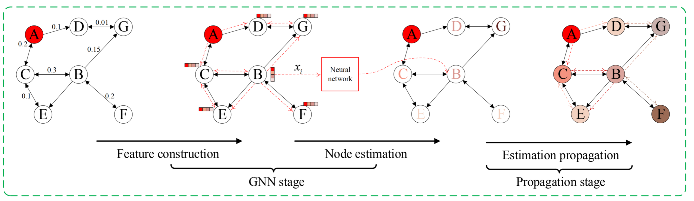
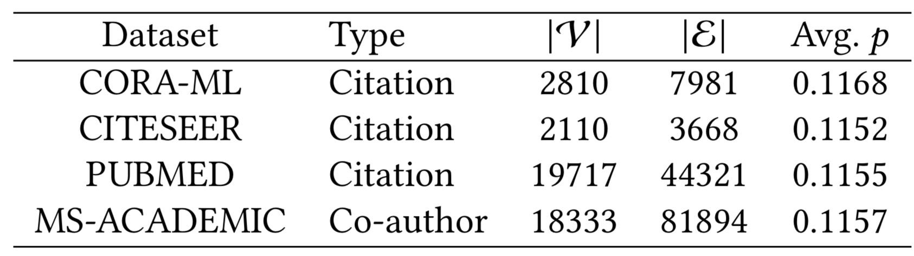
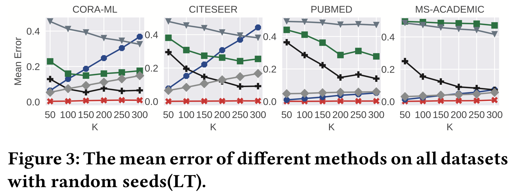
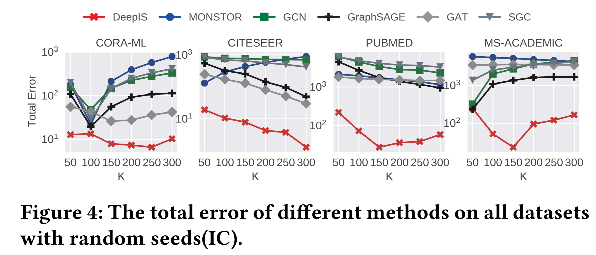
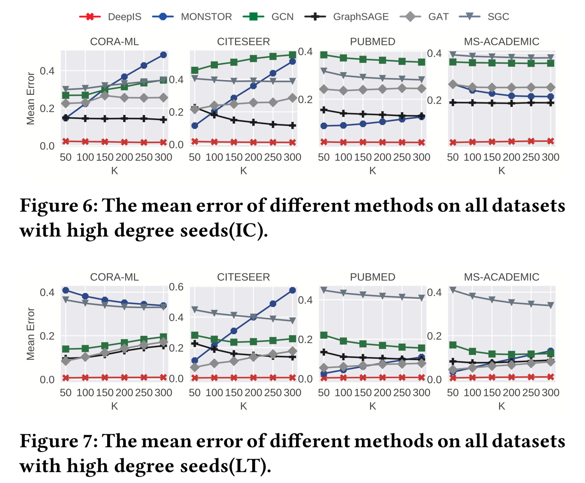
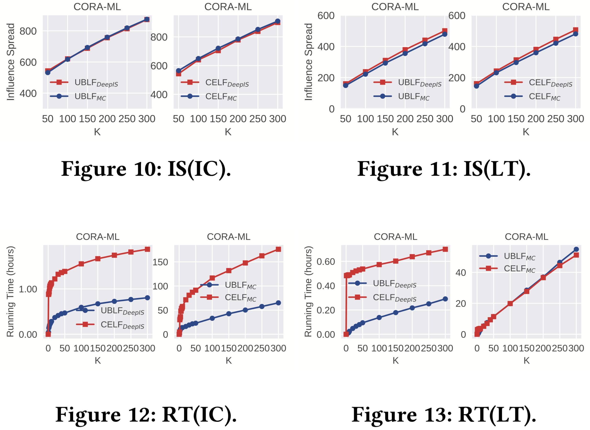
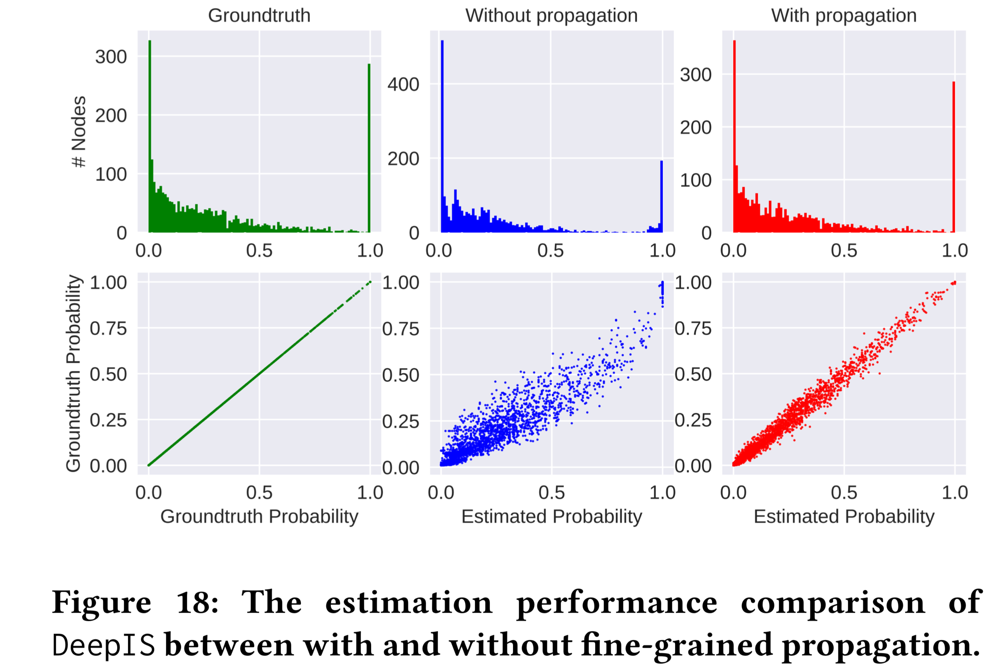

# DeepIS: Susceptibility Estimation on Social Networks

> 用 GNN 解决单个节点的敏感性估计（也可理解为单个节点被种子集 S 激活的概率）

## 1 论文信息

**Author**: Wenwen Xia, Yuchen Li, Jun Wu and Shenghong Li

**Conference**: [WSDM '21](https://dl.acm.org/doi/proceedings/10.1145/3437963)

## 2 背景

使用 GNN 进行影响扩散估计有两个主要挑战：

* GNN 需要通过堆叠多层来聚合多跳邻居的信息，然而，多个堆叠层会导致节点表示过度平滑，并且会损害单个节点上预测任务的性能。
* GNN 使用统一权重或注意力机制聚合邻居的表示，而 GNN 的聚合方案无法捕获底层扩散模型的特定特征。

## 3 问题定义

* 用 𝐷 来表示一个扩散实例，并用 𝐼~𝑆,𝐷~ (𝑛~𝑖~ ) 表示实例 𝐷 上节点 𝑖 的状态 : 

$$
 𝐼_{𝑆,𝐷} (𝑛_i ) = 
 \begin{cases}
 1,\,\,actived\\
 0,\,\,unactived\\
 \end{cases}
$$

* 节点 $i$ 的敏感性表示为：

$$\zeta_𝑆 (𝑛_𝑖 ) = E_{𝐷∼𝑝 (𝐷)} [𝐼_𝑆,𝐷(𝑛_𝑖)]$$

* 种子集的影响力大小表示为：

$$\sigma(𝑆) = \sum_{𝑛_𝑖 \in V} 𝜁_𝑆 (𝑛_𝑖)$$

## 4 DeepIS 模型

**Deep** **I**nfluence **S**pread Estimation（DeepIS）模型由两个阶段组成，即

1. 构造特征以馈送 GNN，用于每个节点的粗粒度敏感性估计。（GNN 阶段）

2. 传播估计，通过迭代过程将每个节点的估计敏感性传播给邻居。最后，用 ground-truth 计算和估计之间的损失，以端到端的方式优化模型。（传播阶段）

### 4.1 GNN 阶段

#### 4.1.1 构造特征

???+ done "边概率矩阵 𝑃"
    给定影响强度矩阵 𝑃

???+ done "种子节点特征 𝒙"
    给定影响强度矩阵 𝑃 和初始种子节点，其中将种子节点 𝑆 表示为多热向量 𝒙， 𝒙[𝑖]=1 or 0

???+ done "节点特征矩阵 X"
    $(𝑃^𝑇 )^𝑑$ 表示从任意种子到任意目标节点的所有长度为 𝑑 的路径
    
    $(𝑃^𝑇 )^𝑑 x$ 表示所有节点的 $d$ 步影响上界
    
    因此节点的特征矩阵为，$𝑋 = [𝒙,𝑃^𝑇𝒙,(𝑃^𝑇)^2𝒙...,(𝑃^𝑇)^𝑑𝒙]$

<!-- ???+ done "节点的敏感性 𝜁~s~"
    将节点的敏感性记作 $\zeta_𝑆$ ，即，$\zeta_𝑆 = [\zeta_𝑆 (n_1), \zeta_𝑆 (n_2), ...]^𝑇$  -->

<!-- 理论上 $\zeta_𝑆$ 和 $\sigma(S)$ 都完全由 𝑃 和 𝒙 决定。 -->

 

#### 4.1.2 节点估计

用非线性神经函数 $𝑓_\theta$ 来预测每个节点的敏感性，本文采用了 2 层的全连接神经网络。

$𝑓 (𝑋)=Sigmoid(Relu(𝑋𝑊_1 +𝒃_1 )𝑊_2 +𝒃_2 )$

$\widehat{𝒚}_𝑖 =𝑓_𝜃(𝑋[𝑖,:])$

???+ warning "预测模型的选择"
    函数 $𝑓_\theta$ 的选择是灵活的，可用其他预测模型来替代上面采用的全连接层，例如，GCN、GAT 等。

### 4.2 传播阶段

#### 4.2.1 传播方案

- IC 模型

    $\widetilde{\zeta}_i = 1− \prod_{n_j \in N(n_𝑖) }(1−𝑃_{ji} \widetilde{\zeta}_j)$

- LT模型

    $\widetilde{\zeta}_i = \sum_{n_j \in N(n_𝑖) }P_{ji} \widetilde{\zeta}_j$

- 以 IC 模型为例，传播函数 $g(·)$ 即为

$$
g(x)=
 \begin{pmatrix}
 g(x_1)\\
 g(x_2)\\
 ...\\
 g(x_n)\\
 \end{pmatrix}
 =
 \begin{pmatrix}
 1− \prod_{n_j \in N(n_1)}(1−𝑃_{j1} x_j)\\
 1− \prod_{n_j \in N(n_2)}(1−𝑃_{j2} x_j)\\
 ...\\
 1− \prod_{n_j \in N(n_n)}(1−𝑃_{jn} x_j)\\
 \end{pmatrix}
$$

- 因此传播方案可定义为，

$$
\begin{align}
\widehat{𝒚}^{(0)} &= \widehat{𝒚} \\
\widehat{𝒚}^{(1)} &= g(\widehat{𝒚}^{(0)}) \\
\widehat{𝒚}^{(q)} &= g(\widehat{𝒚}^{(q-1)})
\end{align}
$$

* 用 AGGREGATE 和 COMBINE 总结传播阶段，即为，

$$
\begin{align}
a_i &= AGGREGATE({x_j, j \in N(n_j)})=g(x_i) \\
h_i &= COMBINE({𝑎_𝑖,𝑥_𝑖})=
\begin{cases}
1, \qquad a_i \in S \\
a_i, \quad \ \ \, a_i \notin S\\
\end{cases}
\end{align}
$$

### 4.3 端到端训练

损失函数设计

- MSE 均方误差

    - 敏感性估计误差

    - $𝐿_{MSE} = \frac{1}{M} \sum^𝑀_{m=1}{\Vert{\widehat{y}_{(𝑚)}} - 𝒚_{(𝑚)}\Vert}_2$

- MRSE 均方相对平方误差

    - 影响传播误差

    - $𝐿_{MRSE} = \frac{1}{M} \sum^𝑀_{m=1}(\frac{\Vert{\widehat{y}_{(𝑚)}}\Vert_1 − \Vert 𝒚_{(𝑚)}\Vert_1}{\Vert y_{(m)}\Vert_1})^2$

最终的 Loss 为

$Loss=\underbrace{L_{MSE}}_{node\, lever\, error} + \underbrace{\lambda L_{MRSE}}_{graph\, lever\, error} + \underbrace{\gamma \Vert \theta \Vert _2}_{regularization\, term}$

它由三个组件组成，具有超参数 $\lambda$ 和 $\gamma$， $L2$ 正则化项旨在减轻过拟合并促进收敛过程。

## 5 实验设置

### 5.1 数据集

{width=400}

- 种子集生成

    - 分别生成 50、100、150、200、250、300 的种子集。
    
- 获取 ground truth
    - 对每个种子集重复 10000 次 MC 模拟以获得 ground truth。

### 5.2 对照算法

??? note "GCN"
    GCN 利用归一化的 Laplacian 矩阵将每个节点的特征与邻居的特征进行平均，并将平均特征转换为共享参数矩阵。

??? note "GraphSAGE"
    GraphSAGE 聚合每个节点的邻居特征并将聚合特征与节点的自身特征连接起来。

??? note "GAT"
    GAT 通过引入注意力机制提高了 GraphSAGE 的性能。注意机制计算聚合层中节点之间的聚合权重，为不同节点引入灵活性和方向性。

???+ note "SGC"
    SGC 通过在预处理阶段传播节点特征，然后用简单的逻辑回归预测每个节点的目标值来简化以前的类 GCN 模型。 SGC 在某种程度上遵循与本文工作类似的理念，即分离传播和预测。

???+ note "MONSTOR"
    MONSTOR 旨在通过堆叠多个 GCN 模型来估计种子集的总影响传播。一种 GNN 模型基于前 GNN 模型的输出预测一步影响传播的增量影响传播。

### 5.3 评价指标

- 平均误差（ME）

- 总误差 (TE)

- 运行时间（RT）

- 影响力延展度 (IS)

## 6 实验结果

### 6.1 随机种子的估计误差

> 随机选取种子集，用不同的对照算法计算单个节点的敏感性，再进行平均误差(ME)的对比。

{width=500}

{width=500}

* ==DeepIS 的平均误差是稳定的，在不同场景下波动在 0.02 左右，平均比基线小 5 倍。==

* ==DeepIS 的总误差存在轻微波动，但总的来看，比其他对照算法要好。==

### 6.2 最高度种子的估计误差

> 选取度值最高的 k 个节点作为种子集，用不同的对照算法计算单个节点的敏感性，再进行平均误差(ME)的对比。

{width=500}

* ==根据度选择的种子比随机选择的种子更有可能诱发高敏感概率。==

* ==DeepIS 仍然具有最小的平均误差。==

### 6.3 在 IM 算法中的效果

> 本组实验选取了 2 个传统 IM 算法 CELF 和 UBLF，将 DeepIS 和传统的蒙特卡洛估计 MC 作为传统算法的组件，来估计影响力延展度，并进行比较。

{width=500}

* ==在影响力延展度上看，由图 10、11 可以看出，用 DeepIS 代替 MC 对 IM 算法计算的种子质量影响较小。==

* ==在运行时间上，可以看出 DeepIS 比 MC 快 4 个数量级。==

### 6.4 传播阶段的重要性
> 第一排的图，横轴代表敏感性，纵轴代表具有相同值的节点数量。
> 
> 第二排的图，显示估计值和目标值之间的关系，横轴代表估计的易感概率，纵轴代表真实情况。每个散点都代表一个节点。

{width=500}

* ==可以看出，DeepIS 模型的传播阶段有效地减少了大多数节点的估计误差。==

