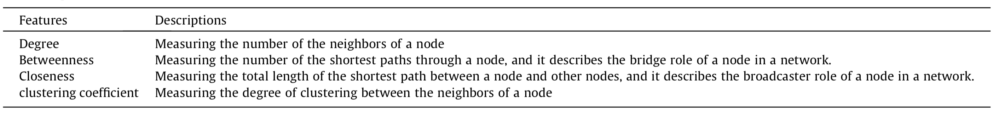
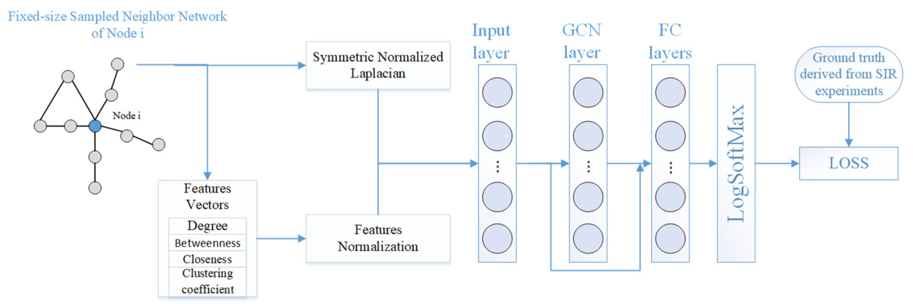
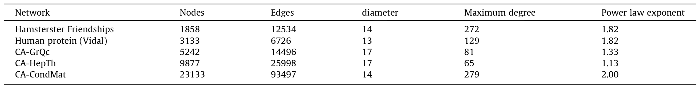
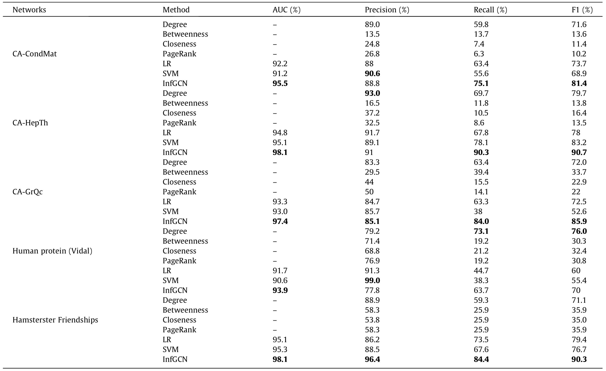

# InfGCN: Identifying influential nodes in complex networks with graph convolutional networks

使用图卷积网络识别复杂网络中的有影响力的节点

## 1 概要

1. 传统方法，如基于中心性的方法和基于机器学习的方法，只考虑网络结构或节点特征来评估节点的重要性。

2. 然而，节点的影响重要性应该由网络结构和节点特征决定。

3. InfGCN 将邻居图和四个经典结构特征作为输入到图卷积网络中，用于学习节点的表示，然后将表示输入到任务学习层，与 ground truth 进行比较。

影响力前 5% 的节点被认为是最有影响力的节点，其他节点被认为是影响力较小的节点。通过这样做，将节点重要性的评估转化为分类任务，并提出了一个名为 InfGCN 的深度学习框架，该框架可以处理节点特征和节点之间的链接。

## 2 相关工作

### 基于中心性的方法

1. 基于距离的方法，基于与节点相关的最短距离，如介数中心性和接近中心性

2. 基于邻居关系的方法，基于邻居节点的数量，如度中心性和半局部中心性

3. 基于迭代的方法，其本质是计算邻居的重要性来衡量节点本身，如特征向量中心性和 PageRank 中心性

4. 基于节点操作的方法，即观察删除或合并节点后的变化。这些方法一般只考虑某种结构。

### 基于机器学习的方法

这些方法的研究主要集中在特征工程，选择更好的特征以获得更好的性能。

该领域常用的机器学习算法包括逻辑回归（LR）和支持向量机（SVM）等。

然而，基于机器学习的方法过于依赖目标对象的特征选择，而忽略了目标之间的关系。

### 基于 GCN 的方法

迭代地聚合邻居的信息，这意味着这些方法既考虑了节点特征，也考虑了他们邻居节点之间的链接。

## 3 InfGCN

1. 我们对固定大小的邻居网络进行采样（参见第 3.1 节），并为每个节点构造由 4 个经典中心组成的特征向量。
2. 将每个节点的邻居网络和特征向量输入到图卷积网络（GCN）层进行表征学习，然后将三个全连接（FC）层输入到带有小批量学习的任务学习中（参见第 3.2 节）。
3. 将模型的输出与 ground-truth 进行比较，以最小化负对数似然损失。
4. 对模型进行预训练以克服小型网络上数据不足的问题（参见第 3.3 节）。

### 模型

输入层、1个 GCN 层、3个全连接层和输出层

节点特征向量：(1)度； (2) 接近中心性； (3)介数中心性； (4) 聚类系数；

为了防止过拟合，对每类特征 k 进行归一化：$f_k=\frac{P_k}{S}-0.5$，其中 P~k~ 表示特征 k 的值排名位置，S 表示网络中的节点数。通过归一化，每个特征的值在0.5和0.5之间变换。

GCN layer：$H^{i+1}= \sigma (AH^iW^i+b^i)$

1. 原始输入由对称归一化拉普拉斯算子和节点特征组成；节点特征由四个经典结构属性(度、接近中心性、介数中心性、聚类系数)组成；

2. GCN 层用于使用图结构和节点特征进行表征学习；同时，在这一层增加了skip connection，更好地利用了节点特征；

3. 三个全连接(FC)层和 LogSoftMax 分类器用于任务学习；
4. 比较模型输出和 ground truth，得到负对数似然损失；
5. 预训练：首先，用大型网络的数据集进行预训练，然后用小型网络的训练数据进行微调，使得该模型可以预测小型网络中的节点。

## 4 数据集标注生成

由于作者将问题构造为二分类问题，即前 5% 的节点认为是最有影响力节点。因此使用 SIR 模型对网络中每个节点进行感染模拟，获得 ground-truth。

## 5 实验

### 数据集

1. Hamsterster Friendships，这是一个包含网站 Hamsterster.com 用户之间的友谊的网络；

2. 人类蛋白质 (Vidal) ，它代表人类二元蛋白质-蛋白质相互作用的蛋白质组尺度图的初始版本；
3. CA-GrQc，这是 Arxiv 广义相对论的协作网络；
4. CA-HepTh，这是 Arxiv 高能物理的协作网络；
5. CA-CondMat，这是 Arxiv 凝聚态的协作网络。

> 前 5% 的节点被认为是网络中最有影响力的节点，而 95% 的节点不是，导致严重的不平衡。为了解决这个问题，我们对影响较小的节点进行采样，并构建一个更平衡的数据集，负数据和正数据的比率为 2:1。
>
> 为了简化我们的实验，我们只考虑度数大于 2 的节点。

### 评价指标

预测性能：我们根据曲线下面积 (AUC) [48]、精度、召回率和 F1-Measure (F1) 评估我们框架的预测性能。

参数敏感：我们分析一些重要的超参数并研究不同的超参数如何影响预测性能。

### 对照算法

1. 机器学习方法
   1. LR 逻辑回归
   2. SVM 支持向量机
2. 基于中心性方法
   1. 度中心性
   2. 介数中心性
   3. 接近中心性
   4. PageRank

### 参数设置

GCN 层包含 8 个隐藏单元。

全连接（FC）层，3个 FC 层分别包含 16、8、2 个单元。

所有参数都使用 Adam 优化器进行训练，学习率为 0.0001，权重衰减为 1e^-4^。

mini-batch 和 dropout rate 分别设置为 32 和 0.2。

为了简化实验，删除了度数小于 3 且始终是网络中影响较小的节点。

epoch 为 200，并通过提前停止选择最佳模型。

## 6 实验结果

